# NeuroWeave — Architecture

> Technical architecture for NeuroWeave v0.1.0.
> For quickstart and usage, see [README.md](README.md).

---

## Table of Contents

- [NeuroWeave — Architecture](#neuroweave--architecture)
  - [Table of Contents](#table-of-contents)
  - [System Overview](#system-overview)
  - [Component View](#component-view)
    - [Configuration System](#configuration-system)
    - [Structured Logging](#structured-logging)
    - [LLM Client Abstraction](#llm-client-abstraction)
    - [Extraction Pipeline](#extraction-pipeline)
    - [Graph Store](#graph-store)
    - [Ingestion Bridge](#ingestion-bridge)
    - [Visualization Server](#visualization-server)
    - [Frontend — `static/index.html`](#frontend--staticindexhtml)
    - [Conversation Loop](#conversation-loop)
  - [Data Flow](#data-flow)
    - [Message Processing Sequence](#message-processing-sequence)
    - [WebSocket Live Update Sequence](#websocket-live-update-sequence)
    - [Application Startup Sequence](#application-startup-sequence)
  - [Data Model](#data-model)
    - [Node Types](#node-types)
    - [Edge Properties](#edge-properties)
    - [Graph Events](#graph-events)
  - [Thread Model](#thread-model)
  - [Error Handling](#error-handling)
  - [Phase 1 Components](#phase-1-components)
  - [Testing Architecture](#testing-architecture)
  - [Design Decisions](#design-decisions)
  - [Future Architecture](#future-architecture)

---

## System Overview

NeuroWeave is a knowledge graph memory system for AI agents. A user types conversational messages into a terminal. Each message is sent to an LLM that extracts structured entities and relations. Those are materialized into an in-memory graph. A browser-based visualization updates in real time via WebSocket as the graph grows.

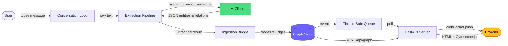

When used as a CLI, the system runs as a single Python process with two threads: the main thread drives the conversation loop (blocking `input()`), and a daemon thread runs the FastAPI/uvicorn server. When used as a library, NeuroWeave runs fully async within the host agent's event loop.

---

## Component View

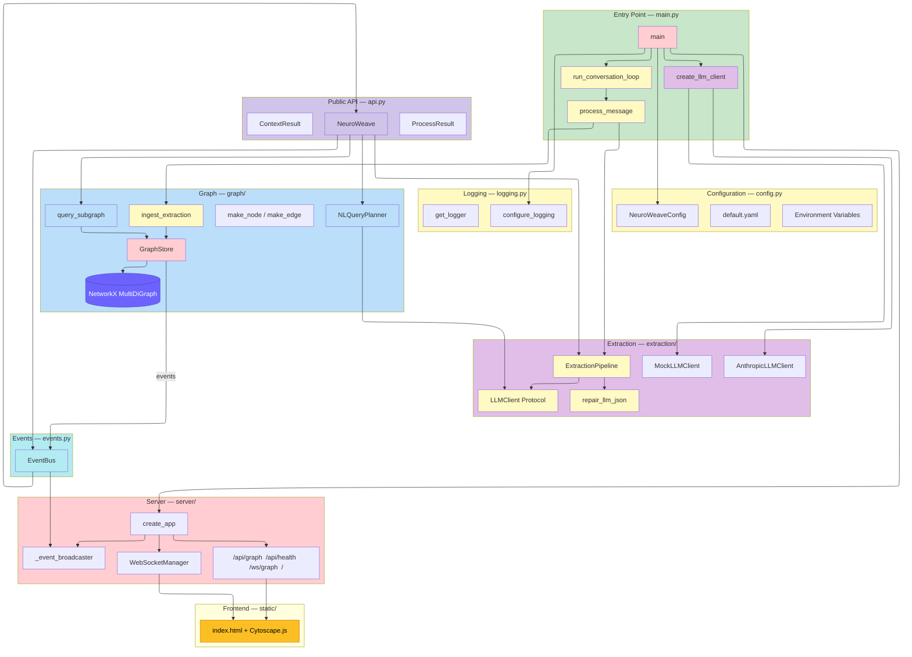

### Configuration System

**File:** `src/neuroweave/config.py`

The configuration system uses `pydantic-settings` with a three-tier loading priority: field defaults → YAML file → environment variables (highest priority). This means a developer can run with zero configuration (defaults work), check in shared settings via YAML, and override anything per-environment with env vars.

| Field | Type | Default | Purpose |
|-------|------|---------|---------|
| `llm_provider` | `LLMProvider` enum | `anthropic` | Which LLM backend to use (`anthropic`, `openai`, `mock`) |
| `llm_model` | `str` | `claude-haiku-4-5-20251001` | Model identifier for the extraction LLM |
| `llm_api_key` | `str` | `""` | API key (reads `ANTHROPIC_API_KEY` as fallback) |
| `extraction_enabled` | `bool` | `True` | Master switch for the extraction pipeline |
| `extraction_confidence_threshold` | `float` | `0.3` | Minimum confidence to store a relation (validated 0.0–1.0) |
| `graph_backend` | `GraphBackend` enum | `memory` | Graph storage backend (`memory` for NetworkX) |
| `server_host` | `str` | `127.0.0.1` | Visualization server bind address |
| `server_port` | `int` | `8787` | Visualization server port (validated 1024–65535) |
| `log_level` | `str` | `INFO` | Logging level |
| `log_format` | `LogFormat` enum | `console` | Log output format (`console` for dev, `json` for production) |

The `NeuroWeaveConfig.load()` classmethod reads `config/default.yaml` first, then overlays any environment variables prefixed with `NEUROWEAVE_`. Switching from a real LLM to a mock for testing is a single change: `NEUROWEAVE_LLM_PROVIDER=mock`.

### Structured Logging

**File:** `src/neuroweave/logging.py`

All logging uses `structlog` with key-value structured output. Every component gets a named logger via `get_logger("component_name")` which automatically binds the component name to all log entries.

Two output modes:

- **Console** — colored, human-readable, for development
- **JSON** — machine-parseable, one JSON object per line, for production and log aggregation

Third-party loggers (uvicorn, httpx) are suppressed to WARNING+ to keep output clean.

Key log events emitted by the system:

| Event | Component | Fields |
|-------|-----------|--------|
| `extraction.start` | pipeline | `message_length` |
| `extraction.complete` | pipeline | `entity_count`, `relation_count`, `duration_ms` |
| `extraction.parse_failed` | pipeline | `raw_response` (truncated) |
| `extraction.llm_error` | pipeline | `error` |
| `ingest.complete` | ingest | `nodes_added`, `edges_added`, `edges_skipped`, `total_nodes`, `total_edges` |
| `ingest.unknown_source` | ingest | `source`, `relation` |
| `graph.node_added` | store | `node_id`, `name`, `node_type` |
| `graph.edge_added` | store | `edge_id`, `source`, `target`, `relation`, `confidence` |
| `ws.client_connected` | server | `total` |
| `server.started` | server | `static_dir` |
| `neuroweave.started` | main | `version`, `llm_provider`, `llm_model`, `graph_backend` |

### LLM Client Abstraction

**File:** `src/neuroweave/extraction/llm_client.py`

The extraction pipeline depends on the `LLMClient` protocol, not a concrete implementation. This is the central testability mechanism — tests inject a `MockLLMClient`, production uses `AnthropicLLMClient`.

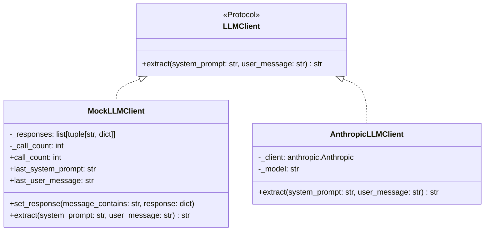

**`MockLLMClient`** matches user messages by case-insensitive substring. When `"I love Python"` is sent and a response is registered for `"i love python"`, the mock returns the canned JSON. If no substring matches, it returns `{"entities": [], "relations": []}`. The mock tracks call count and the last prompts sent, enabling test assertions on LLM interaction.

**`AnthropicLLMClient`** calls `anthropic.Anthropic().messages.create()` with the extraction system prompt and user message. It logs token usage on success and raises `LLMError` on API failures.

### Extraction Pipeline

**File:** `src/neuroweave/extraction/pipeline.py`

The pipeline takes a raw conversational message and returns structured entities and relations. In the POC, this is a single LLM call. The production system will evolve this into a 7-stage pipeline (entity → relation → sentiment → temporal → confidence → graph diff), but the interface stays the same.

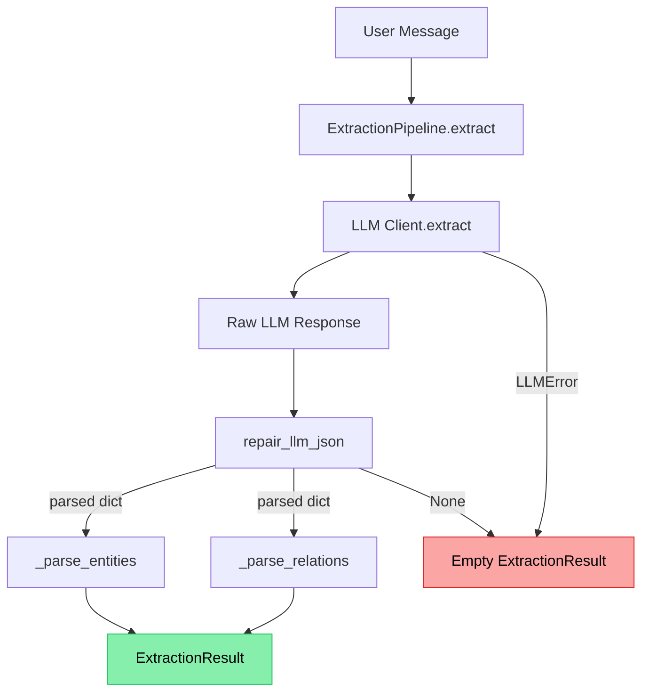

**System prompt** instructs the LLM to:

- Refer to the speaking user as `"User"` in all output
- Extract people, organizations, tools, technologies, places, and concepts
- Assign confidence scores: 0.85–0.95 for explicit statements, 0.40–0.60 for hedged language, high for negations
- Return empty arrays for filler messages ("Thanks!", "OK")
- Output *only* valid JSON — no surrounding text

**JSON repair** handles the six most common LLM output issues, applied in order:

| Issue | Repair | Success rate |
|-------|--------|--------------|
| Markdown code fences (` ```json ... ``` `) | Strip fence markers | ~95% |
| Preamble text before JSON | Find first `{` or `[`, parse from there | ~90% |
| Trailing commas | Regex removal before `}` and `]` | ~90% |
| Unclosed brackets/braces (token truncation) | Count open vs close, append missing closers | ~60% |
| Mixed JSON + explanation after | Handled by preamble stripping | ~85% |
| Complete garbage (no JSON at all) | Return `None`, log warning | N/A |

**Resilience contract:** `ExtractionPipeline.extract()` never raises. LLM errors, parse failures, and malformed entities all result in an empty `ExtractionResult`. The caller always gets a valid object.

**Data types:**

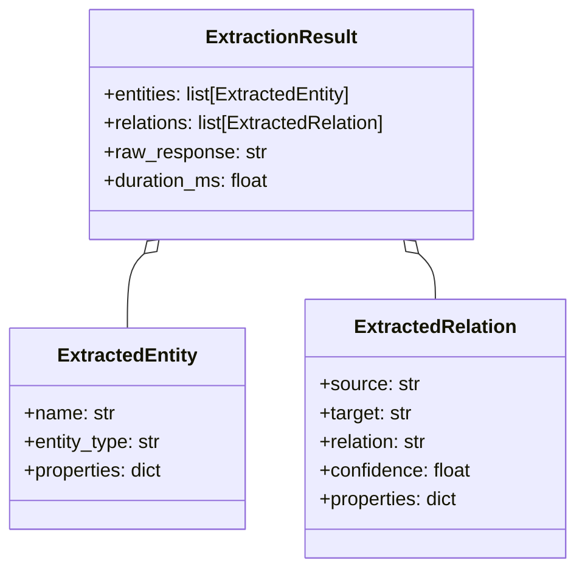

All three are frozen dataclasses (`frozen=True, slots=True`) — immutable after creation.

### Graph Store

**File:** `src/neuroweave/graph/store.py`

The in-memory graph is backed by a NetworkX `MultiDiGraph`. MultiDiGraph was chosen because the knowledge graph needs parallel directed edges between the same pair of nodes (e.g., Alex →married_to→ Lena AND Alex →works_with→ Lena).

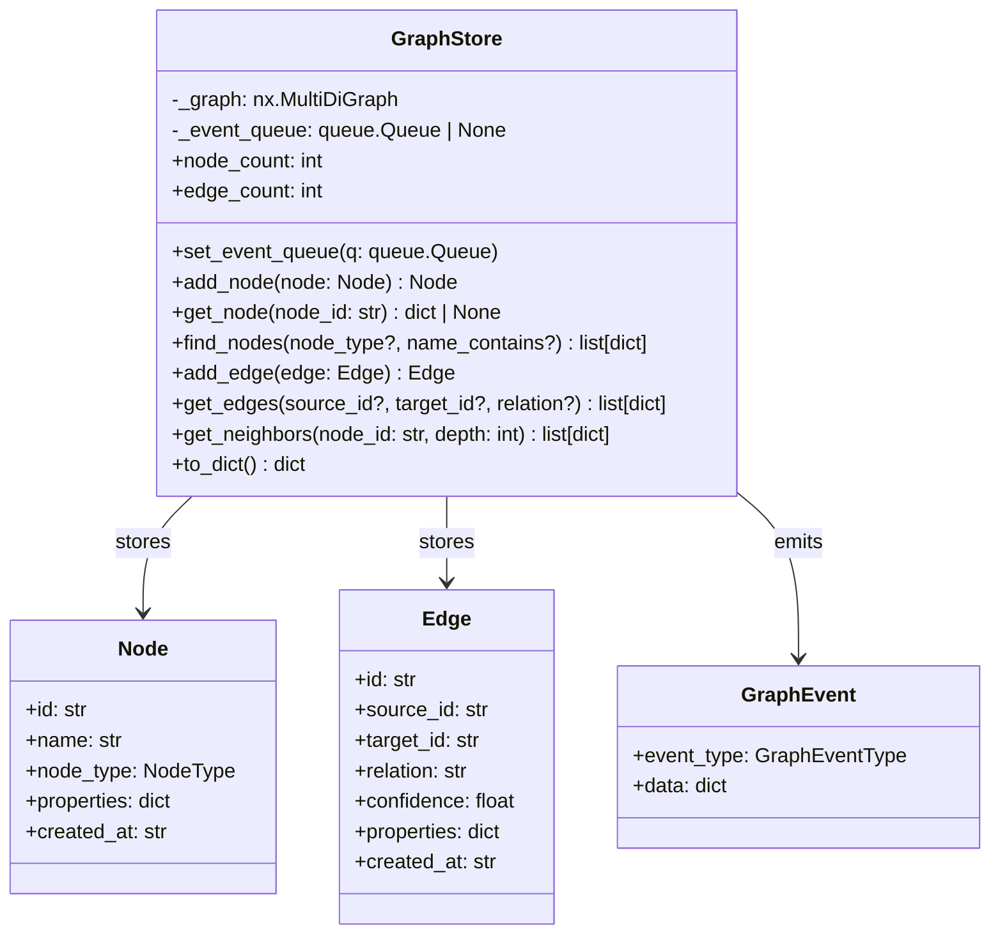

**Event emission:** Every `add_node()` and `add_edge()` call pushes a `GraphEvent` to a `queue.Queue` (stdlib, thread-safe). The event carries the full serialized node or edge data. If no queue is attached, mutations are silent. If the queue is full (maxsize=1000), the event is dropped with a warning log. This makes events opt-in and non-blocking — the graph store never stalls waiting for consumers.

**Query interface:**

| Method | Purpose | Used by |
|--------|---------|---------|
| `find_nodes(node_type, name_contains)` | Case-insensitive search by type and/or name substring | Ingestion (dedup), terminal `/graph` command |
| `get_edges(source_id, target_id, relation)` | Filter edges by any combination of source, target, relation | E2E tests, terminal `/graph` command |
| `get_neighbors(node_id, depth)` | BFS traversal to find all nodes within N hops | E2E tests (centrality check) |
| `to_dict()` | Full graph serialization: `{nodes, edges, stats}` | REST `/api/graph`, WebSocket snapshot |

### Ingestion Bridge

**File:** `src/neuroweave/graph/ingest.py`

The bridge translates extraction-domain objects (`ExtractedEntity`, `ExtractedRelation`) into graph-domain objects (`Node`, `Edge`) and materializes them into the store. It owns the deduplication logic.

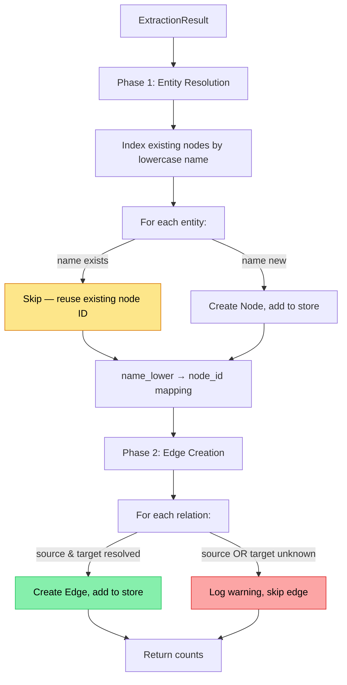

**Entity type mapping:** Extraction types map to graph `NodeType`:

| Extraction `entity_type` | Graph `NodeType` |
|--------------------------|------------------|
| `person`, `organization`, `place` | `ENTITY` |
| `tool`, `concept` | `CONCEPT` |
| `preference` | `PREFERENCE` |

**Deduplication** is by lowercase name. `"User"` from message 1 and `"user"` from message 3 resolve to the same node. This is intentionally simple for the POC — production would use entity resolution with embeddings.

### Visualization Server

**File:** `src/neuroweave/server/app.py`

The FastAPI server provides three interfaces:

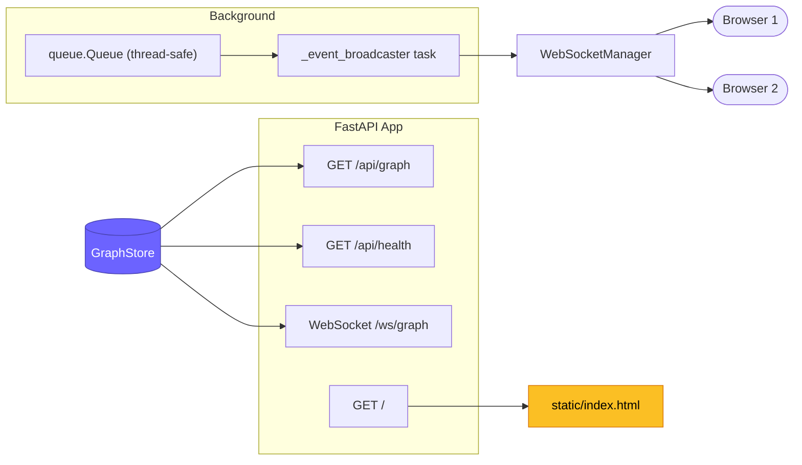

**REST endpoints:**

| Endpoint | Response |
|----------|----------|
| `GET /` | Serves `static/index.html` |
| `GET /api/graph` | Full graph as `{nodes: [...], edges: [...], stats: {node_count, edge_count}}` |
| `GET /api/health` | `{status, graph: {node_count, edge_count}, websocket_clients}` |

**WebSocket protocol (`/ws/graph`):**

1. Client connects → server sends a `snapshot` message with the full current graph
2. As mutations occur, the event broadcaster sends incremental messages:

| Message type | When | Payload |
|--------------|------|---------|
| `snapshot` | On connect | `{type: "snapshot", data: {nodes, edges, stats}}` |
| `node_added` | New node created | `{type: "node_added", data: {id, name, node_type, ...}, stats: {...}}` |
| `node_updated` | Existing node modified | `{type: "node_updated", data: {...}, stats: {...}}` |
| `edge_added` | New edge created | `{type: "edge_added", data: {id, source_id, target_id, relation, confidence, ...}, stats: {...}}` |

**Event broadcaster:** An asyncio task that polls the thread-safe `queue.Queue` every 50ms. When it finds events, it serializes them to JSON and broadcasts to all connected WebSocket clients via `WebSocketManager`. Dead connections are automatically removed on send failure.

### Frontend — `static/index.html`

A single HTML file with inline CSS and JavaScript. No build step, no node_modules.

**Libraries:** Cytoscape.js (loaded from CDN) — handles force-directed layout, labeled directed edges, zoom/pan, and node selection natively.

**Node styling by type:**

| Node Type | Color | Size |
|-----------|-------|------|
| Entity | `#6c63ff` (purple) | 35px |
| Concept | `#4ade80` (green) | 28px |
| Preference | `#fbbf24` (amber) | 28px |
| Episode | `#f472b6` (pink) | 28px |
| Experience | `#38bdf8` (sky) | 28px |

**Edge labels** show `relation (confidence)`, e.g., `married_to (0.90)`. Edge width scales with confidence (1px + confidence × 3px).

**Behavior:**

1. On page load, fetches `/api/graph` via REST (catches up if opened mid-conversation)
2. Connects to `/ws/graph` WebSocket with automatic reconnect (3s backoff)
3. On `snapshot` message: clears graph, loads all nodes and edges, runs force-directed layout
4. On `node_added` / `edge_added`: adds element, shows toast notification, re-runs layout with 500ms animation
5. Stats bar updates in real time: node count, edge count, last update time, connection status indicator (green/red dot)

### Conversation Loop

**File:** `src/neuroweave/main.py`

The entry point wires all components together and runs the interactive loop.

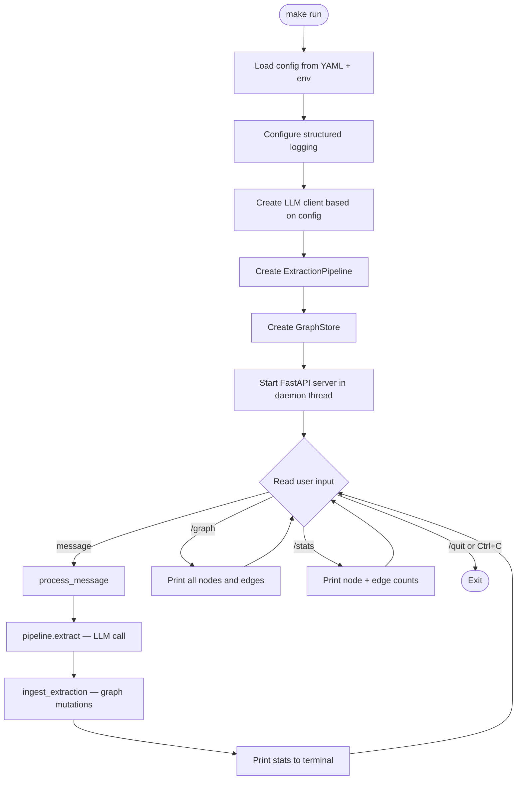

**`process_message()`** is the core function, deliberately extracted from the loop for testability. It takes a message, pipeline, and store, returns a stats dict. Both the interactive loop and the test suite call this same function.

**Terminal commands:**

| Command | Action |
|---------|--------|
| `/graph` | Print all nodes (by type) and all edges (with relation and confidence) |
| `/stats` | Print node count and edge count |
| `/quit` | Exit the program |

---

## Data Flow

### Message Processing Sequence

This is the core data flow — what happens when a user types a message.

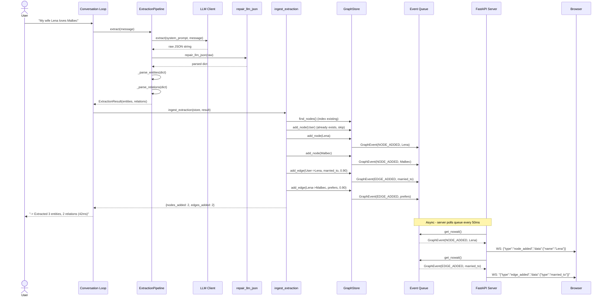

### WebSocket Live Update Sequence

Shows what happens when a browser connects and receives updates.

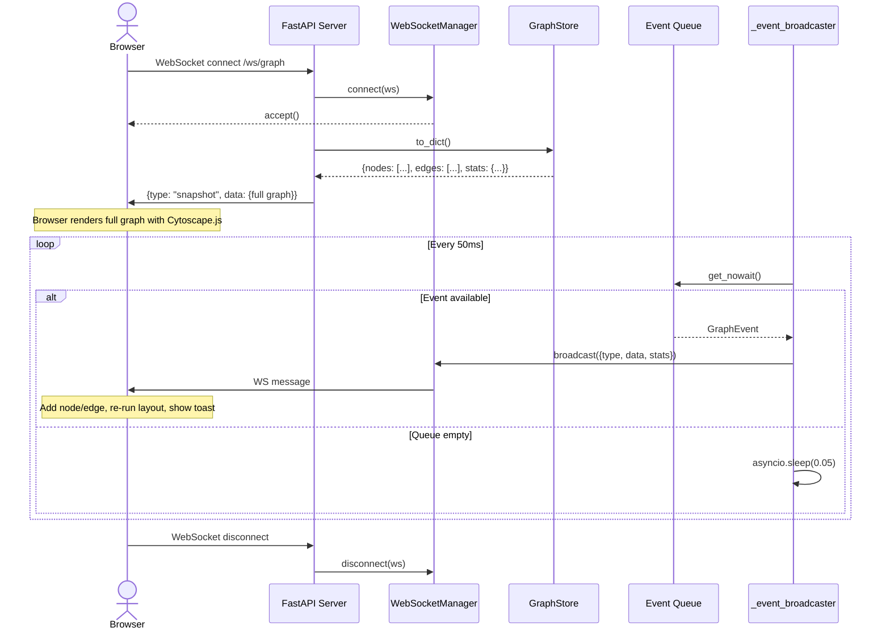

### Application Startup Sequence

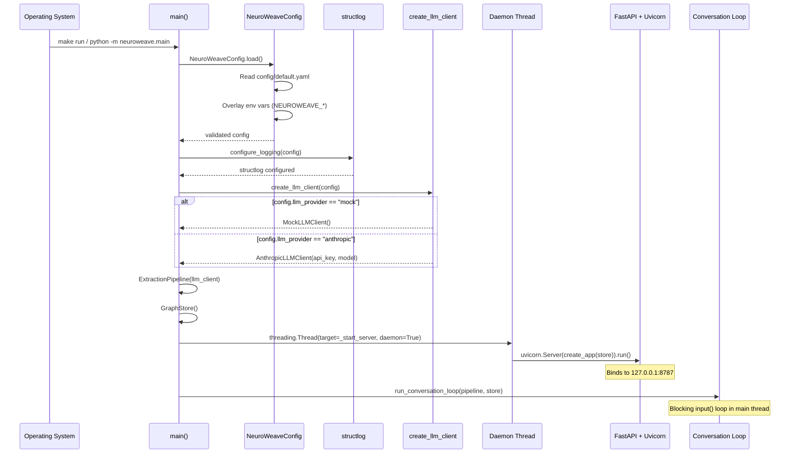

---

## Data Model

### Node Types

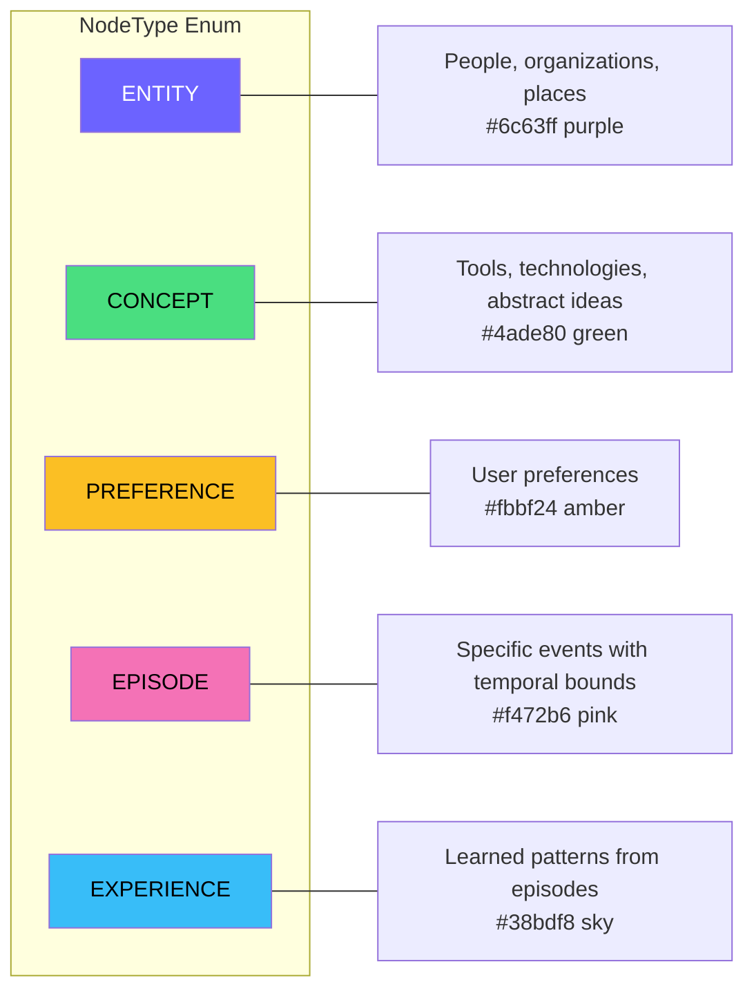

### Edge Properties

Every edge in the graph carries:

| Property | Type | Description |
|----------|------|-------------|
| `id` | `str` | Unique edge identifier (`e_` prefix + 12 hex chars) |
| `source_id` | `str` | ID of the source node |
| `target_id` | `str` | ID of the target node |
| `relation` | `str` | Typed relationship (`prefers`, `married_to`, `traveling_to`, `experienced_with`, ...) |
| `confidence` | `float` | 0.0–1.0, clamped on ingestion. Higher = more certain. |
| `properties` | `dict` | Arbitrary metadata (e.g., `{"timeframe": "March 2026"}`) |
| `created_at` | `str` | ISO 8601 UTC timestamp |

### Graph Events

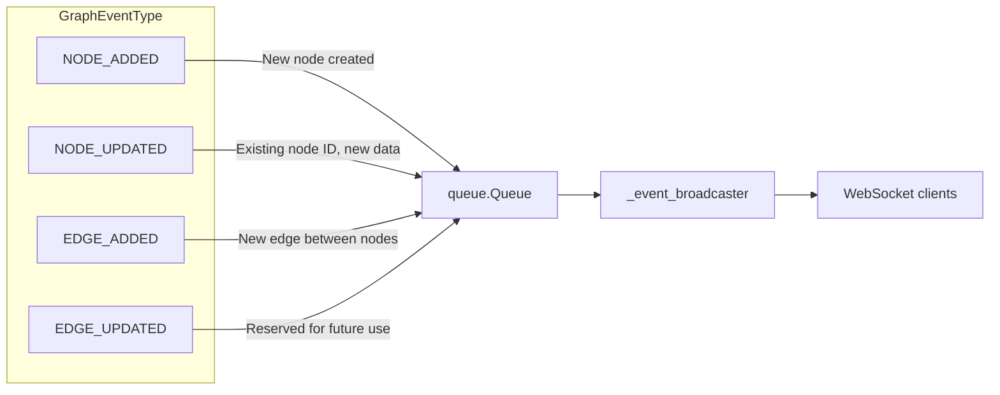

---

## Thread Model

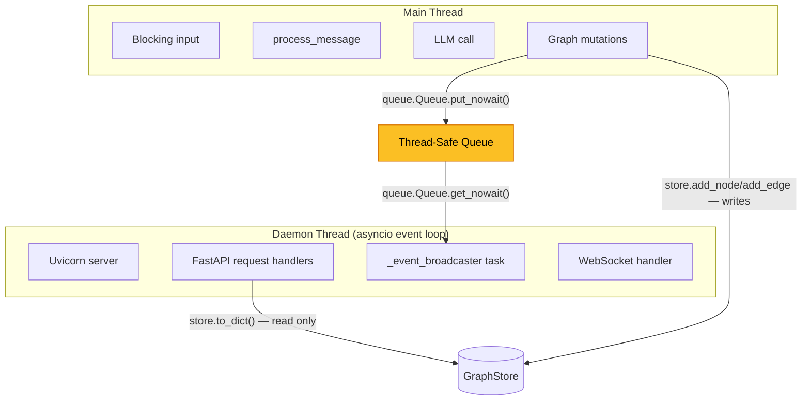

**Why `queue.Queue` instead of `asyncio.Queue`:** The conversation loop (main thread) and the FastAPI server (daemon thread) run in different threads with different event loops. `asyncio.Queue` is *not* thread-safe across event loops — `put_nowait()` from one thread into another thread's queue is undefined behavior. `queue.Queue` from the standard library is designed for exactly this cross-thread producer/consumer pattern.

**Thread safety of GraphStore:** The store is single-writer (main thread writes during `process_message()`) and multi-reader (server thread reads via `to_dict()` and `get_node()`). NetworkX's `MultiDiGraph` is not thread-safe for concurrent read+write, but the POC's access pattern is safe in practice: writes complete synchronously in `process_message()` before the next `input()` blocks, and reads happen in the gaps. Production will add a `threading.Lock`.

---

## Error Handling

The system follows a "never crash, degrade gracefully" philosophy:

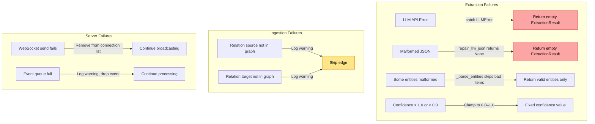

| Failure | Impact | Recovery |
|---------|--------|----------|
| LLM API timeout/error | No extraction for this message | Empty result, log error, continue |
| LLM returns garbage | No extraction for this message | JSON repair attempted, then empty result |
| Entity missing required fields | That entity skipped | Other valid entities still processed |
| Confidence out of [0,1] | Edge stored with wrong weight | Clamped automatically |
| Relation references unknown entity | Edge not created | Logged, other edges still created |
| WebSocket client disconnects | One fewer viewer | Removed from broadcast list |
| Event queue full (1000 items) | Events dropped | Logged, graph still correct, browser can refresh |

---

## Phase 1 Components

Phase 1 (v0.1.0) adds the library integration layer on top of the POC, transforming NeuroWeave from a standalone CLI into an importable async Python library.

### Query Engine (`neuroweave.graph.query`)

Structured queries with entity resolution (case-insensitive name matching), hop traversal (BFS from seed entities), relation filtering, and confidence thresholds. Returns a `QueryResult` dataclass containing matching nodes, edges, and traversal metadata.

```python
result = query_subgraph(store, entities=["Lena"], relations=["prefers"], max_hops=1)
result.node_names()  # ['Lena', 'sushi']
```

### NL Query Planner (`neuroweave.graph.nl_query`)

Translates natural language questions into structured query plans by injecting the current graph schema (entity names, relation types, node types) into an LLM prompt. The LLM returns a JSON query plan which is parsed and executed against the graph store. Falls back to a broad whole-graph search if the LLM returns unparseable output.

```python
planner = NLQueryPlanner(llm_client, store)
result = await planner.query("what does my wife like?")
# LLM resolves "my wife" → Lena, "like" → prefers relation
```

### Event Bus (`neuroweave.events`)

Async pub/sub system replacing the raw `queue.Queue` approach from the POC. Subscribers register async callbacks, optionally filtering by event type. Emission is non-blocking via `asyncio.create_task()` — one slow handler doesn't block others. A 5-second timeout per handler invocation triggers a warning but does not cancel the handler. Handler exceptions are caught and counted, never propagated.

```python
bus = EventBus()
await bus.subscribe(handler, event_types={GraphEventType.NODE_ADDED})
await bus.emit(GraphEvent(event_type=GraphEventType.NODE_ADDED, data={...}))
```

### NeuroWeave Facade (`neuroweave.api`)

The public API entry point that wires all components together. Provides three main methods:

| Method | Direction | Returns |
|--------|-----------|--------|
| `process(message)` | Write | `ProcessResult` — extraction details + graph delta |
| `query(...)` | Read | `QueryResult` — auto-detects structured vs NL |
| `get_context(message)` | Write + Read | `ContextResult` — process + query combined |

Supports both programmatic construction and YAML-based configuration. Async context manager for lifecycle management. Optionally starts the visualization server.

```python
async with NeuroWeave(llm_provider="mock") as nw:
    context = await nw.get_context("My wife Lena loves sushi")
    print(context.relevant.node_names())
```

---

## Testing Architecture

```mermaid
graph TB
    subgraph "test_smoke.py — 2 tests"
        SMOKE[Package imports, version, wiring]
    end

    subgraph "test_config.py — 9 tests"
        CONFIG[Defaults, YAML override, env override, validation]
    end

    subgraph "test_logging.py — 8 tests"
        LOGGING[Console output, JSON output, filtering, binding]
    end

    subgraph "test_graph.py — 30 tests"
        GRAPH[Add/get/find nodes, edges, neighbors, serialization, events, factories]
    end

    subgraph "test_extraction.py — 30 tests"
        EXTRACTION[JSON repair, MockLLM, entity/relation extraction, resilience]
    end

    subgraph "test_ingest.py — 13 tests"
        INGEST_T[Entity dedup, type mapping, edge creation, cross-message growth]
    end

    subgraph "test_server.py — 10 tests"
        SERVER_T[REST endpoints, WebSocket snapshot, health check]
    end

    subgraph "test_e2e.py — 22 tests ★"
        E2E[5-message conversation → graph structure, relationships, confidence, centrality]
    end

    subgraph "test_live_updates.py — 12 tests"
        LIVE[Event emission, server reflects graph, incremental growth via API]
    end

    subgraph "test_query.py — 37 tests"
        QUERY[Structured queries, hop traversal, entity resolution, confidence filter]
    end

    subgraph "test_nl_query.py — 38 tests"
        NL[NL query planner, parsing, fallback, schema injection]
    end

    subgraph "test_events.py — 33 tests"
        EVENTS[EventBus lifecycle, timeout, errors, type filtering]
    end

    subgraph "test_api.py — 36 tests"
        API[Facade lifecycle, process, query, get_context, events]
    end

    subgraph "test_integration.py — 28 tests"
        INTEG[Full end-to-end with 5-message corpus through facade]
    end

    SMOKE --> CONFIG
    CONFIG --> LOGGING
    LOGGING --> GRAPH
    GRAPH --> EXTRACTION
    EXTRACTION --> INGEST_T
    INGEST_T --> SERVER_T
    SERVER_T --> E2E
    E2E --> LIVE
    LIVE --> QUERY
    QUERY --> NL
    NL --> EVENTS
    EVENTS --> API
    API --> INTEG

    style INTEG fill:#6c63ff,stroke:#4a44b3,color:#fff
    style E2E fill:#6c63ff,stroke:#4a44b3,color:#fff
```

**Total: ~308 tests across 16 test files.**

The test corpus in `conftest.py` defines a shared 5-message conversation with pre-registered mock LLM responses. Both `test_extraction.py` (unit) and `test_e2e.py` / `test_live_updates.py` / `test_integration.py` (integration) use this same corpus, ensuring consistency across test layers.

**`test_e2e.py` is the POC proof.** If these 22 tests pass, the core claim is validated: a conversation with an AI agent results in a correctly structured knowledge graph.

**`test_integration.py` is the Phase 1 proof.** These 28 tests run the full 5-message corpus through the `NeuroWeave` facade, verifying that `process()`, `query()`, `get_context()`, and event subscription all work end-to-end.

---

## Design Decisions

| Decision | Choice | Rationale | Phase |
|----------|--------|-----------|-------|
| Graph library | NetworkX `MultiDiGraph` | In-memory, zero setup, parallel edges, swap to Neo4j later with same interface | POC |
| LLM abstraction | Python `Protocol` | Structural typing — no base class inheritance, mock and real clients are interchangeable | POC |
| Event delivery | `EventBus` (async pub/sub) | Replaces raw `queue.Queue`. Type-filtered subscriptions, timeout monitoring, error isolation. Non-blocking via `asyncio.create_task()` | Phase 1 |
| Server framework | FastAPI + uvicorn | Async WebSocket support, fast REST, minimal boilerplate | POC |
| Frontend | Single HTML file with Cytoscape.js CDN | No build step, no node_modules, instant dev feedback | POC |
| Config loading | YAML → env vars | Checked-in defaults for reproducibility, env overrides for deployment | POC |
| Logging | structlog (JSON + console) | Structured key-value pairs from day one, trivial to switch to JSON for production | POC |
| Test strategy | Mock LLM as first-class citizen | Fast, deterministic, free — real LLM integration tests come later | POC |
| Extraction | Single LLM call | POC simplicity. Production evolves to 7-stage pipeline behind same interface | POC |
| Deduplication | Case-insensitive name match | Simple for POC. Production uses embedding-based entity resolution | POC |
| Query engine | BFS hop traversal | Structured queries with entity resolution, relation filtering, confidence thresholds. Interface designed for Neo4j swap | Phase 1 |
| NL queries | LLM-powered query planning | Inject graph schema into LLM prompt, parse response into structured query. Graceful fallback to broad search | Phase 1 |
| Public API | Facade pattern | Single `NeuroWeave` class hides all internals. Three methods: `process()`, `query()`, `get_context()`. Async context manager | Phase 1 |
| Library packaging | Hatchling + PEP 561 | Modern build backend, `py.typed` marker for type checker support, clean `__all__` exports | Phase 1 |

---

## Future Architecture

The POC validates the core loop: **conversation → extraction → graph → visualization**. The production system adds:

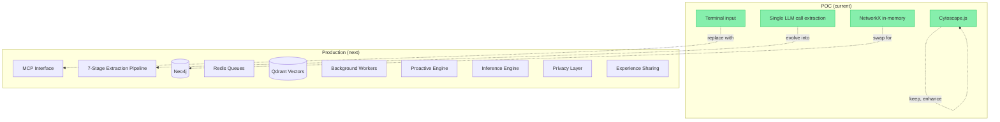

| Component | POC | Production |
|-----------|-----|------------|
| Input | Terminal `input()` | MCP tools (`em_report_interaction`) |
| Extraction | Single LLM call, mock or Haiku | 7-stage pipeline: entity → relation → sentiment → temporal → confidence → graph diff |
| Graph | NetworkX in-memory | Neo4j with Cypher queries |
| Events | `queue.Queue` polling | Redis Streams with consumer groups |
| Vectors | None | Qdrant for episode similarity |
| Background | None | APScheduler: revision, decay, inference, event monitoring |
| Privacy | None | L0–L4 classification, PII detection, GDPR compliance |
| Sharing | None | Differential privacy, shared experience pool |

The interfaces are designed for this evolution. `GraphStore` methods (`add_node`, `get_edges`, `find_nodes`, `to_dict`) map directly to Neo4j Cypher operations. The `LLMClient` protocol accepts any backend. The `ExtractionPipeline.extract()` return type stays the same whether it's one LLM call or seven stages.
