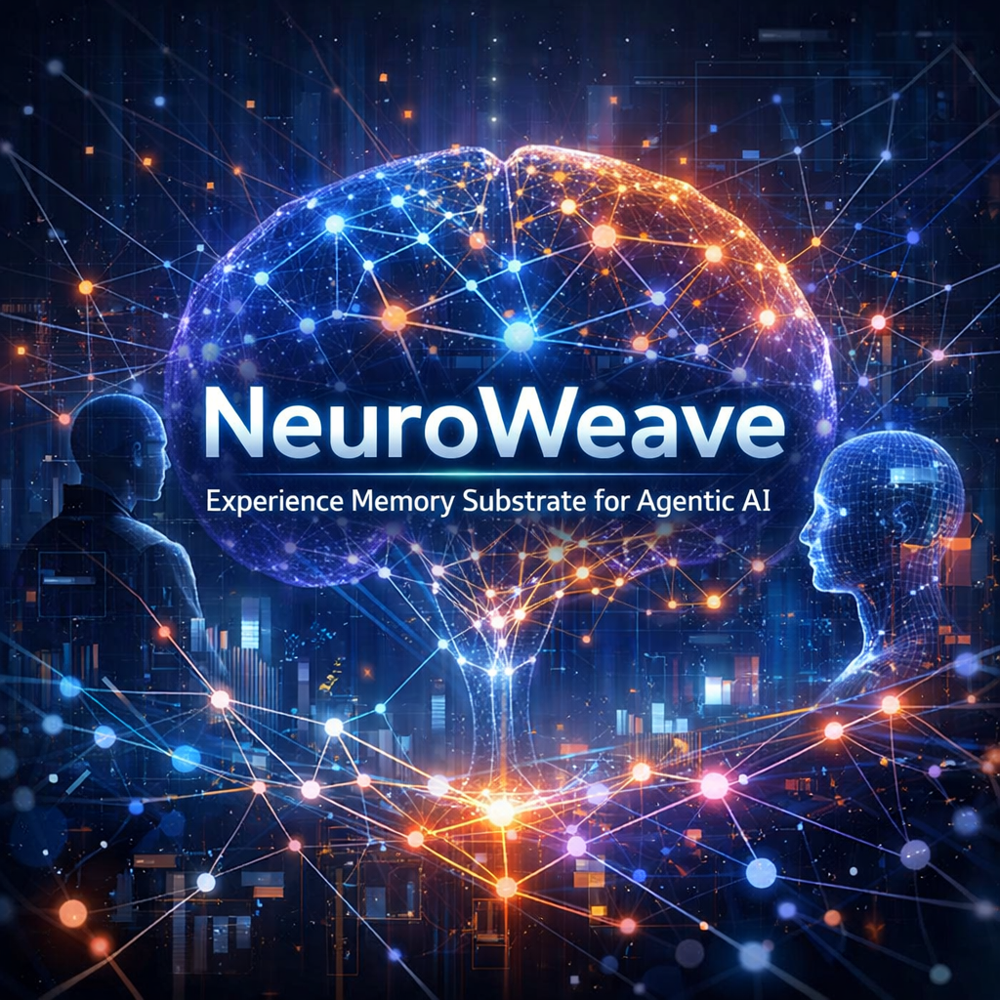
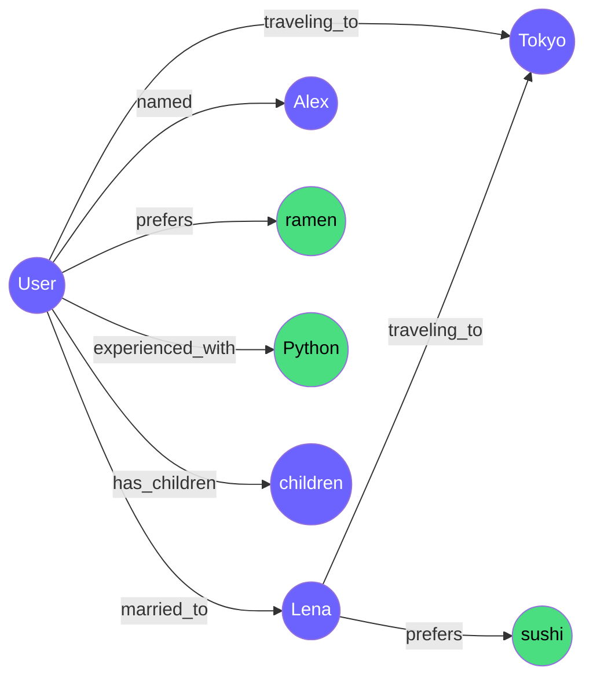

<p align="center">
  
</p>

<h1 align="center">NeuroWeave</h1>

<p align="center">
  <strong>Real-time knowledge graph memory for agentic AI platforms.</strong>
</p>

<p align="center">
  <em>Agents that learn. Memory that compounds. Privacy that's provable.</em>
</p>

<p align="center">
  <a href="#installation">Installation</a> •
  <a href="#quickstart">Quickstart</a> •
  <a href="https://neuroweave.readthedocs.io">Documentation</a> •
  <a href="ARCHITECTURE.md">Architecture</a> •
  <a href="CHANGELOG.md">Changelog</a>
</p>

<p align="center">
  <a href="https://python.org"></a>
  <a href="https://neuroweave.readthedocs.io"></a>
  <a href="LICENSE"></a>
  <a href="https://pypi.org/project/neuroweave/"></a>
</p>

---

## What This Is

NeuroWeave is an async Python library that transforms AI conversations into a **live knowledge graph**. As a user chats with an AI agent, NeuroWeave extracts entities and relationships from each message, materializes them into a graph, and lets the agent query that graph to recall facts, preferences, and connections.

```python
from neuroweave import NeuroWeave

async with NeuroWeave(llm_provider="anthropic") as nw:
    # Agent feeds user messages — graph builds automatically
    await nw.process("My wife Lena and I are going to Tokyo in March")
    await nw.process("She loves sushi but I prefer ramen")

    # Query for relevant context
    result = await nw.query("what does my wife like?")
    # → nodes: [Lena, sushi]  edges: [Lena --prefers--> sushi]
```

Open `http://localhost:8787` to watch the graph build in real time:



---

## Installation

```bash
pip install neuroweave
```

Or install from source:

```bash
git clone https://github.com/neuroweave/neuroweave.git
cd neuroweave
make install    # pip install -e ".[dev]"
```

---

## Quickstart

### As a Library (recommended)

```python
import asyncio
from neuroweave import NeuroWeave

async def main():
    async with NeuroWeave(
        llm_provider="anthropic",
        llm_api_key="sk-ant-...",
    ) as nw:
        # Write path — extract knowledge, update the graph
        result = await nw.process("My wife Lena loves Malbec")
        print(f"Extracted {result.entity_count} entities")

        # Read path — structured query
        result = await nw.query(["Lena"], relations=["prefers"], max_hops=1)
        print(result.node_names())  # ['Lena', 'Malbec']

        # Read path — natural language (LLM translates to graph query)
        result = await nw.query("what does my wife like?")

        # Combined — process + query in one call (primary agent integration)
        context = await nw.get_context("remind me about dinner")
        print(context.relevant.node_names())

asyncio.run(main())
```

### Mock Mode (no API key needed)

```python
async with NeuroWeave(llm_provider="mock") as nw:
    ...
```

### As a CLI

```bash
# With real LLM
export NEUROWEAVE_LLM_API_KEY=sk-ant-...
neuroweave

# With mock LLM (no API key needed)
NEUROWEAVE_LLM_PROVIDER=mock neuroweave
```

### Demo Agent

```bash
python examples/demo_agent.py              # Canned demo (mock, no API key)
python examples/demo_agent.py -i           # Interactive mode
python examples/demo_agent.py --provider anthropic  # With real LLM
```

---

## API Overview

### Three Methods

| Method | Purpose | Returns |
|--------|---------|---------|
| `process(message)` | Extract knowledge, update graph | `ProcessResult` |
| `query(...)` | Query the graph (structured or NL) | `QueryResult` |
| `get_context(message)` | Process + query combined | `ContextResult` |

### Event Subscription

```python
from neuroweave import EventType

async def on_new_entity(event):
    print(f"Discovered: {event.data['name']}")

nw.subscribe(on_new_entity, event_types={EventType.NODE_ADDED})
```

### Visualization

```python
nw = NeuroWeave(enable_visualization=True, server_port=8787)
# Graph visible at http://127.0.0.1:8787 with WebSocket live updates
```

Full documentation: **[neuroweave.readthedocs.io](https://neuroweave.readthedocs.io)**

---

## Configuration

Three-tier system: **field defaults → YAML → environment variables** (highest priority).

```yaml
# config/default.yaml
llm_provider: "anthropic"
llm_model: "claude-haiku-4-5-20251001"
graph_backend: "memory"
server_host: "127.0.0.1"
server_port: 8787
log_level: "INFO"
log_format: "console"
```

```bash
# Environment variable overrides
NEUROWEAVE_LLM_PROVIDER=mock
NEUROWEAVE_LLM_API_KEY=sk-ant-...
NEUROWEAVE_LOG_FORMAT=json
```

---

## Project Structure

```
neuroweave/
├── src/neuroweave/
│   ├── __init__.py              # Public exports: NeuroWeave, ProcessResult, ...
│   ├── api.py                   # NeuroWeave facade class (the public API)
│   ├── config.py                # Pydantic settings: YAML + env vars
│   ├── events.py                # EventBus async pub/sub
│   ├── logging.py               # structlog: console or JSON output
│   ├── main.py                  # CLI entry point
│   ├── extraction/
│   │   ├── llm_client.py        # LLMClient protocol + Mock + Anthropic
│   │   └── pipeline.py          # Message → ExtractionResult
│   ├── graph/
│   │   ├── store.py             # NetworkX graph + event emission
│   │   ├── ingest.py            # ExtractionResult → graph nodes and edges
│   │   ├── query.py             # Structured query engine
│   │   └── nl_query.py          # NL → structured query via LLM
│   └── server/
│       └── app.py               # FastAPI: REST + WebSocket + Cytoscape.js
├── tests/                       # ~308 tests across 16 files
├── examples/
│   └── demo_agent.py            # Self-contained demo agent
├── docs/                        # MkDocs documentation (readthedocs.io)
├── config/default.yaml
├── static/index.html            # Cytoscape.js visualizer
├── pyproject.toml
├── mkdocs.yml
├── .readthedocs.yaml
├── LICENSE                      # Apache 2.0
└── CHANGELOG.md
```

---

## Testing

```bash
make test           # All ~308 tests
make test-cov       # With coverage report
make lint           # Ruff linting
make format         # Auto-format
```

| Test File | Tests | Coverage |
|-----------|-------|----------|
| `test_smoke.py` | 2 | Package imports, wiring |
| `test_config.py` | 9 | Defaults, YAML, env overrides |
| `test_logging.py` | 8 | Console/JSON output, filtering |
| `test_graph.py` | 30 | Node/edge CRUD, events, factories |
| `test_extraction.py` | 30 | JSON repair, mock LLM, resilience |
| `test_ingest.py` | 13 | Dedup, type mapping, growth |
| `test_server.py` | 10 | REST, WebSocket, health |
| `test_e2e.py` | 22 | Full POC proof: 5-msg → graph |
| `test_live_updates.py` | 12 | Event emission, server reflects graph |
| `test_query.py` | 37 | Structured queries, hop traversal |
| `test_nl_query.py` | 38 | NL query planner, parsing, fallback |
| `test_events.py` | 33 | EventBus lifecycle, timeout, errors |
| `test_api.py` | 36 | Facade lifecycle, process, query |
| `test_integration.py` | 28 | Full end-to-end with corpus |

---

## Dependencies

**Core:** anthropic ≥0.42, networkx ≥3.2, fastapi ≥0.115, structlog ≥25.5, pydantic-settings ≥2.7, uvicorn ≥0.34, websockets ≥16.0, pyyaml ≥6.0

**Dev:** pytest, pytest-asyncio, pytest-cov, httpx, ruff

**Docs:** mkdocs-material, mkdocstrings

---

## License

[Apache 2.0](LICENSE)

---

<p align="center">
  <strong>NeuroWeave</strong> — Agents that learn. Memory that compounds. Privacy that's provable.
</p>
