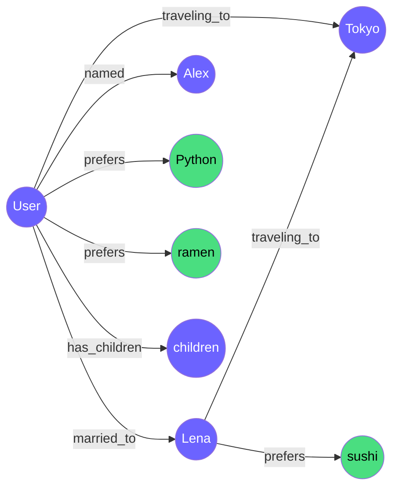
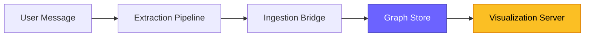

<p align="center">
  
</p>

<h1 align="center">NeuroWeave</h1>

<p align="center">
  <strong>Real-time knowledge graph memory for agentic AI platforms.</strong>
</p>

<p align="center">
  <em>Agents that learn. Memory that compounds. Privacy that's provable.</em>
</p>

<p align="center">
  <a href="#quickstart">Quickstart</a> •
  <a href="ARCHITECTURE.md">Architecture</a> •
  <a href="#how-it-works">How It Works</a> •
  <a href="#configuration">Configuration</a> •
  <a href="#testing">Testing</a> •
  <a href="#vision">Vision</a>
</p>

<p align="center">
  <a href="https://python.org"></a>
  <a href="https://github.com/user/neuroweave/blob/master/LICENSE"></a>
</p>

---

## What This Is

NeuroWeave transforms AI conversations into a **live knowledge graph**. As a user chats, an LLM extracts entities and relationships from each message. Those are materialized into a graph that grows over time. A browser-based visualizer shows the graph building in real time.

This POC proves the core loop: **conversation → extraction → graph → visualization**.

```
You: My wife Lena and I are going to Tokyo in March
  → Extracted 3 entities, 3 relations (47ms)
  → Graph: 5 nodes, 4 edges (+2 nodes, +3 edges)
```

Open `http://localhost:8787` and watch the graph appear:



---

## Quickstart

### Prerequisites

- Python 3.11+
- An Anthropic API key (or use mock mode for zero-cost testing)

### Install

```bash
git clone https://github.com/user/neuroweave.git
cd neuroweave
make install
```

### Run with a real LLM

```bash
export ANTHROPIC_API_KEY=sk-ant-...
make run
```

### Run with mock LLM (no API key needed)

```bash
NEUROWEAVE_LLM_PROVIDER=mock make run
```

### Open the visualizer

Navigate to [http://127.0.0.1:8787](http://127.0.0.1:8787) in your browser. The graph updates live as you chat in the terminal.

### Run the tests

```bash
make test           # All ~136 tests
make test-e2e       # Just the proof: conversation → graph
make test-cov       # With coverage report
```

---

## How It Works

Each message flows through four stages:



**1. Extraction Pipeline** — sends the message plus a system prompt to an LLM (Claude Haiku in production, mock in tests). The LLM returns structured JSON with entities and relations. A JSON repair layer handles common LLM output issues (markdown fences, trailing commas, truncated output). The pipeline **never raises** — failures return an empty result.

**2. Ingestion Bridge** — translates extracted entities into graph nodes and relations into edges. Deduplicates by name (case-insensitive) so "User" from message 1 and "user" from message 5 are the same node. Skips edges that reference unknown entities.

**3. Graph Store** — a NetworkX `MultiDiGraph` that supports parallel directed edges (Alex →married_to→ Lena AND Alex →works_with→ Lena). Every mutation emits a `GraphEvent` to a thread-safe queue. The interface is designed so swapping to Neo4j later changes only the implementation, not the callers.

**4. Visualization Server** — FastAPI serves a Cytoscape.js single-page app. On connect, the browser receives the full graph snapshot. As new nodes and edges are added, the server pushes them via WebSocket. The graph re-layouts with animation.

For the full component breakdown, sequence diagrams, data model, thread model, and design decisions, see **[ARCHITECTURE.md](ARCHITECTURE.md)**.

---

## Project Structure

```
neuroweave/
├── src/neuroweave/
│   ├── __init__.py              # Package root, version
│   ├── main.py                  # Entry point: config → LLM → pipeline → graph → server → loop
│   ├── config.py                # Pydantic settings: YAML + env vars + validation
│   ├── logging.py               # structlog: console (dev) or JSON (prod) output
│   ├── extraction/
│   │   ├── __init__.py
│   │   ├── llm_client.py        # LLMClient protocol + Mock + Anthropic implementations
│   │   └── pipeline.py          # Message → ExtractionResult (entities + relations)
│   ├── graph/
│   │   ├── __init__.py
│   │   ├── store.py             # NetworkX graph + event emission + query interface
│   │   └── ingest.py            # ExtractionResult → graph nodes and edges
│   └── server/
│       ├── __init__.py
│       └── app.py               # FastAPI: REST + WebSocket + static file serving
├── tests/
│   ├── conftest.py              # Shared fixtures: config, logging, mock LLM corpus
│   ├── test_smoke.py            # 2 tests — package imports, wiring
│   ├── test_config.py           # 9 tests — defaults, YAML, env, validation
│   ├── test_logging.py          # 8 tests — console, JSON, filtering, binding
│   ├── test_graph.py            # 30 tests — nodes, edges, neighbors, events, factories
│   ├── test_extraction.py       # 30 tests — JSON repair, mock LLM, entities, resilience
│   ├── test_ingest.py           # 13 tests — dedup, type mapping, cross-message growth
│   ├── test_server.py           # 10 tests — REST, WebSocket, health
│   ├── test_e2e.py              # 22 tests — THE POC PROOF ★
│   └── test_live_updates.py     # 12 tests — event emission, server reflects graph
├── static/
│   └── index.html               # Cytoscape.js visualizer (single file, no build step)
├── config/
│   └── default.yaml             # Checked-in default configuration
├── pyproject.toml               # Build config, 9 core + 5 dev dependencies
├── Makefile                     # install, test, lint, run, clean
├── ARCHITECTURE.md              # Detailed technical architecture
├── IMPLEMENTATION_PLAN.md       # 9-step build plan (completed)
└── .gitignore
```

---

## Configuration

NeuroWeave uses a three-tier configuration system: **field defaults → YAML → environment variables** (highest priority).

### `config/default.yaml`

```yaml
llm_provider: "anthropic"
llm_model: "claude-haiku-4-5-20251001"
extraction_enabled: true
extraction_confidence_threshold: 0.3
graph_backend: "memory"
server_host: "127.0.0.1"
server_port: 8787
log_level: "INFO"
log_format: "console"
```

### Environment variable overrides

All fields can be overridden with `NEUROWEAVE_` prefixed env vars:

```bash
NEUROWEAVE_LLM_PROVIDER=mock          # Use mock LLM (no API key needed)
NEUROWEAVE_LOG_FORMAT=json             # JSON logs for production
NEUROWEAVE_SERVER_PORT=9000            # Different port
ANTHROPIC_API_KEY=sk-ant-...           # API key (also reads NEUROWEAVE_LLM_API_KEY)
```

### Key settings

| Setting | Values | Default | Purpose |
|---------|--------|---------|---------|
| `llm_provider` | `anthropic`, `openai`, `mock` | `anthropic` | Which LLM to use for extraction |
| `llm_model` | any model string | `claude-haiku-4-5-20251001` | Model for extraction calls |
| `graph_backend` | `memory` | `memory` | Graph storage (NetworkX). Neo4j planned. |
| `log_format` | `console`, `json` | `console` | Colored dev output or machine-parseable JSON |
| `extraction_confidence_threshold` | 0.0–1.0 | 0.3 | Minimum confidence to store a relation |

---

## Testing

### Test suite summary

| File | Tests | What it proves |
|------|-------|----------------|
| `test_smoke.py` | 2 | Package installs, core wiring works |
| `test_config.py` | 9 | Defaults, YAML override, env override, validation rejects bad input |
| `test_logging.py` | 8 | Console and JSON output, log level filtering, context binding |
| `test_graph.py` | 30 | Node/edge CRUD, neighbor traversal, serialization, event emission |
| `test_extraction.py` | 30 | JSON repair (8 scenarios), mock LLM matching, entity/relation parsing, resilience |
| `test_ingest.py` | 13 | Deduplication, type mapping, unknown entity handling, incremental growth |
| `test_server.py` | 10 | REST endpoints, WebSocket snapshot, health check |
| **`test_e2e.py`** | **22** | **★ The POC proof: 5-message conversation → correctly structured graph** |
| `test_live_updates.py` | 12 | Events emitted to queue, server reflects graph, incremental API growth |

### The POC proof — `test_e2e.py`

This is the single most important test file. It feeds a 5-message conversation:

```
1. "My name is Alex and I'm a software engineer"
2. "My wife Lena and I are going to Tokyo in March"
3. "She loves sushi but I prefer ramen"
4. "We have two kids, both in elementary school"
5. "I've been using Python for 10 years"
```

...through the full pipeline and asserts:

- The graph contains ≥8 nodes (Alex, Lena, User, Tokyo, Python, sushi, ramen, children)
- The graph contains ≥8 edges (named, married_to, traveling_to, prefers, has_children, experienced_with)
- Relationships have correct types and confidence scores (explicit facts ≥ 0.85)
- No orphan edges (every edge connects two existing nodes)
- User is the central node (most connected)
- The graph grows monotonically — never shrinks between messages

### Make targets

```bash
make test           # All tests
make test-unit      # Unit tests only
make test-e2e       # E2E proof only
make test-cov       # With coverage report
make lint           # Ruff linting
make format         # Ruff auto-format
```

---

## Dependencies

### Core (9 packages)

| Package | Version | Purpose |
|---------|---------|---------|
| `anthropic` | ≥0.42 | Claude API client for extraction |
| `networkx` | ≥3.2 | In-memory knowledge graph |
| `pydantic-settings` | ≥2.7 | Typed configuration with validation |
| `structlog` | ≥25.5 | Structured logging (console + JSON) |
| `fastapi` | ≥0.115 | REST + WebSocket server |
| `uvicorn[standard]` | ≥0.34 | ASGI server |
| `websockets` | ≥16.0 | WebSocket protocol support |
| `pyyaml` | ≥6.0 | YAML config file parsing |

### Dev (5 packages)

| Package | Purpose |
|---------|---------|
| `pytest` | Test framework |
| `pytest-asyncio` | Async test support |
| `pytest-cov` | Coverage reporting |
| `httpx` | FastAPI TestClient backend |
| `ruff` | Linting + formatting |

---

## Vision

This POC validates the core concept. The full NeuroWeave system adds:

| Capability | POC | Production |
|------------|-----|------------|
| Input | Terminal | MCP tools for any agent runtime |
| Extraction | Single LLM call | 7-stage pipeline (entity → relation → sentiment → temporal → confidence → graph diff) |
| Graph | NetworkX in-memory | Neo4j with Cypher |
| Events | `queue.Queue` | Redis Streams |
| Vectors | — | Qdrant for episode similarity search |
| Background | — | Revision workers, confidence decay, inference chains |
| Proactive | — | Contextual probes, conversation starters, anticipatory suggestions |
| Privacy | — | L0–L4 classification, PII detection, GDPR compliance, CVM deployment |
| Sharing | — | Differential privacy, cross-agent experience transfer |

The interfaces are designed for this evolution. `GraphStore` methods map to Neo4j Cypher. The `LLMClient` protocol accepts any backend. `ExtractionPipeline.extract()` returns the same type whether it's one LLM call or seven stages.

For the full production architecture, see the [design documents](docs/) and [ARCHITECTURE.md](ARCHITECTURE.md).

---

## License

[Apache 2.0](LICENSE)

---

<p align="center">
  <strong>NeuroWeave</strong> — Agents that learn. Memory that compounds. Privacy that's provable.
</p>
