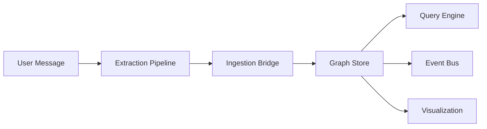

# Architecture

For the full technical architecture document, see the
[ARCHITECTURE.md](https://github.com/neuroweave/neuroweave/blob/main/ARCHITECTURE.md)
file in the repository root.

## System Overview

NeuroWeave is a knowledge graph memory system for AI agents. User messages flow through an LLM-powered extraction pipeline that identifies entities and relationships. These are materialized into an in-memory graph that agents can query — either with structured parameters or natural language questions.



## Component Map

```
┌─────────────────────────────────────────────────────┐
│  Agent Process (owns conversation loop)             │
│                                                     │
│  ┌─────────────────────────────────────────────┐    │
│  │         NeuroWeave (async library)           │    │
│  │                                             │    │
│  │  ┌──────────┐  ┌────────────┐  ┌────────┐  │    │
│  │  │ process() │  │  query()   │  │ events │  │    │
│  │  │  (write)  │  │  (read)    │  │ (push) │  │    │
│  │  └─────┬─────┘  └─────┬──────┘  └───┬────┘  │    │
│  │        │               │             │       │    │
│  │  ┌─────▼───────────────▼─────────────▼──┐   │    │
│  │  │  ExtractionPipeline  │  QueryEngine  │   │    │
│  │  │  IngestBridge        │  NLQueryPlanner│   │    │
│  │  └─────────┬────────────┴───────┬───────┘   │    │
│  │            │                    │            │    │
│  │  ┌─────────▼────────────────────▼────────┐  │    │
│  │  │           GraphStore (NetworkX)        │  │    │
│  │  └───────────────────┬───────────────────┘  │    │
│  │                      │ optional              │    │
│  │  ┌───────────────────▼───────────────────┐  │    │
│  │  │     Visualization Server (FastAPI)     │  │    │
│  │  └───────────────────────────────────────┘  │    │
│  └─────────────────────────────────────────────┘    │
└─────────────────────────────────────────────────────┘
```

## Key Components

### Extraction Pipeline (`neuroweave.extraction`)

Sends user messages + a system prompt to an LLM. The LLM returns structured JSON with entities and relations. A JSON repair layer handles common LLM output issues (markdown fences, trailing commas, truncated output). The pipeline never raises — failures return an empty result.

### Graph Store (`neuroweave.graph.store`)

A NetworkX `MultiDiGraph` supporting parallel directed edges. Every mutation emits a `GraphEvent` through the `EventBus`. The interface is designed so swapping to Neo4j later changes only the implementation, not the callers.

### Query Engine (`neuroweave.graph.query`)

Structured queries with entity resolution (case-insensitive name matching), hop traversal (BFS from seed entities), relation filtering, and confidence thresholds.

### NL Query Planner (`neuroweave.graph.nl_query`)

Translates natural language questions into structured query plans by injecting the current graph schema into the LLM prompt. Falls back to broad whole-graph search if the LLM returns unparseable output.

### Event Bus (`neuroweave.events`)

Async pub/sub with type filtering, timeout monitoring, and error isolation. Non-blocking emission via `asyncio.create_task()`.

### Visualization Server (`neuroweave.server`)

FastAPI serves a Cytoscape.js single-page app with WebSocket live updates.

## Design Documents

Additional design documents are available in the repository:

- [Experience Memory Architecture](https://github.com/neuroweave/neuroweave/blob/main/docs/design/em_arch_overview.md)
- [Experience Memory Integration](https://github.com/neuroweave/neuroweave/blob/main/docs/design/em_integration.md)
- [Experience Memory Pre-Design](https://github.com/neuroweave/neuroweave/blob/main/docs/design/em_pre_design.md)
- [Experience Memory System](https://github.com/neuroweave/neuroweave/blob/main/docs/design/experience_memory.md)
