# Experience Memory: NeuroWeave's Agent Experience Architecture

**NeuroWeave Technical Deep-Dive — February 2026**

---

## 1. The Problem with "Memory" in Agentic AI Today

Every agentic platform claims to have memory. What they actually have is a log.

Most agent memory systems — including OpenClaw's persistent memory — store conversation history as sequential text. When the agent needs context, it performs retrieval over past messages. This is fundamentally **recall**, not **understanding**. The agent can retrieve what was said. It cannot reason about what was learned.

This distinction matters because an agent that merely recalls conversations will:

- Repeat questions the user already answered in a different context
- Fail to connect insights across separate interactions
- Treat each skill invocation as isolated, with no accumulated expertise
- Be unable to transfer learned patterns to novel situations
- Have no model of the user beyond keyword matching over transcripts

NeuroWeave replaces this with **Experience Memory** — a graph-based, structured, evolving representation of everything an agent learns through interaction, observation, and action. The agent doesn't just remember. It *knows*.

---

## 2. Three Layers of Agent Knowledge

```mermaid
graph TB
    subgraph Layer_1: Recall
        direction LR
        L1["Conversation Logs<br/>Sequential text storage"]
        L1A["'User said they like Python'<br/>'User asked about flights to Tokyo'<br/>'User cancelled the meeting'"]
    end

    subgraph Layer_2: Understanding
        direction LR
        L2["Knowledge Graph<br/>Structured entity-relationship model"]
        L2A["User → prefers → Python<br/>User → plans_trip → Tokyo [March 2026]<br/>User → works_at → Acme Corp<br/>Acme Corp → industry → FinTech"]
    end

    subgraph Layer_3: Experience
        direction LR
        L3["Experience Memory<br/>Procedural + episodic + semantic"]
        L3A["When User asks for code → use Python, prefer type hints<br/>User's travel style → budget-conscious, prefers direct flights<br/>Meeting cancellations correlate with sprint deadlines<br/>Acme Corp's Q1 is high-stress → adjust tone and urgency"]
    end

    Layer_1 -->|"Extraction &<br/>structuring"| Layer_2
    Layer_2 -->|"Pattern recognition<br/>& inference"| Layer_3

    style Layer_1 fill:#fdd,stroke:#c00
    style Layer_2 fill:#fff3cd,stroke:#856404
    style Layer_3 fill:#d4edda,stroke:#155724
```

| Layer             | What It Stores                                                      | How It's Used                                               | Who Has It                     |
| ----------------- | ------------------------------------------------------------------- | ----------------------------------------------------------- | ------------------------------ |
| **Recall**        | Raw conversation transcripts                                        | Keyword search, RAG retrieval                               | OpenClaw, ChatGPT, most agents |
| **Understanding** | Entities, relationships, facts                                      | Structured queries, fact lookup                             | Some enterprise platforms      |
| **Experience**    | Learned behaviors, patterns, procedures, preferences, causal models | Anticipation, adaptation, transfer learning across contexts | **NeuroWeave**             |

OpenClaw operates at Layer 1. NeuroWeave operates across all three, with Experience Memory as the primary differentiator.

---

## 3. Experience Memory Architecture

### 3.1 Core Graph Structure

Experience Memory is built on a **typed, temporal, weighted knowledge graph** where nodes represent entities, concepts, and experiences, and edges represent relationships with temporal and confidence metadata.

```mermaid
graph LR
    subgraph Entities
        U["👤 User"]
        P1["🐍 Python"]
        P2["🦀 Rust"]
        C["🏢 Acme Corp"]
        T["✈️ Tokyo Trip"]
        M["📅 Sprint Planning"]
    end

    subgraph Experiences
        E1["💡 Experience:<br/>User debugging style"]
        E2["💡 Experience:<br/>Travel booking pattern"]
        E3["💡 Experience:<br/>Communication preferences"]
    end

    subgraph Procedures
        PR1["📋 Procedure:<br/>Code review workflow"]
        PR2["📋 Procedure:<br/>Meeting prep routine"]
    end

    U -->|"prefers<br/>confidence: 0.95<br/>since: 2025-11"| P1
    U -->|"learning<br/>confidence: 0.60<br/>since: 2026-01"| P2
    U -->|"works_at<br/>role: CTO"| C
    U -->|"planning<br/>dates: Mar 2026"| T

    E1 -->|"learned_from"| U
    E1 -->|"applies_to"| P1
    E1 -->|"pattern"| PR1

    E2 -->|"learned_from"| U
    E2 -->|"applies_to"| T

    E3 -->|"context"| C
    E3 -->|"context"| M

    style E1 fill:#d4edda,stroke:#155724
    style E2 fill:#d4edda,stroke:#155724
    style E3 fill:#d4edda,stroke:#155724
    style PR1 fill:#cce5ff,stroke:#004085
    style PR2 fill:#cce5ff,stroke:#004085
```

### 3.2 Node Types

| Node Type      | Description                                            | Examples                                                |
| -------------- | ------------------------------------------------------ | ------------------------------------------------------- |
| **Entity**     | People, organizations, tools, places                   | User, Acme Corp, Python, Tokyo                          |
| **Concept**    | Abstract ideas, domains, topics                        | Machine learning, budget optimization, sprint velocity  |
| **Episode**    | A specific interaction or event with temporal bounds   | "Debugged OAuth issue on Jan 15", "Booked Tokyo flight" |
| **Experience** | A learned pattern derived from one or more episodes    | "User prefers to see error logs before suggestions"     |
| **Procedure**  | A multi-step workflow the agent has learned or refined | "Code review: lint → test → diff → summary"             |
| **Preference** | An explicit or inferred user preference                | "Prefers concise responses before 10am"                 |
| **Context**    | Environmental or situational metadata                  | "Q1 crunch", "Pre-launch week", "Traveling"             |

### 3.3 Edge Properties

Every edge in the graph carries metadata that enables temporal reasoning and confidence decay:

| Edge Property     | Purpose                                                           |
| ----------------- | ----------------------------------------------------------------- |
| `relation`        | Typed relationship (prefers, knows, works_at, learned_from, etc.) |
| `confidence`      | 0.0–1.0 score, increases with reinforcement, decays over time     |
| `first_observed`  | Timestamp of initial discovery                                    |
| `last_reinforced` | Timestamp of most recent supporting evidence                      |
| `source_episodes` | Links to the specific interactions that established this edge     |
| `decay_rate`      | How quickly confidence degrades without reinforcement             |
| `context_tags`    | Situational tags that scope when this edge is relevant            |

---

## 4. How Experience Is Built

Experience Memory is not populated by the user filling out a profile. It is **constructed continuously** through four mechanisms:

### 4.1 Experience Acquisition Pipeline

```mermaid
sequenceDiagram
    participant U as User
    participant A as Agent
    participant EE as Extraction Engine
    participant KG as Knowledge Graph
    participant XM as Experience Memory

    U->>A: "Can you refactor this Python function?<br/>Use type hints, I hate untyped code."
    A->>A: Execute task (refactor code)
    A->>U: Refactored code with type hints

    par Background Processing
        A->>EE: Process interaction
        EE->>EE: Extract entities: [Python, type hints]
        EE->>EE: Extract preference: strict typing
        EE->>EE: Extract sentiment: strong negative → untyped code
        EE->>KG: Upsert: User →prefers→ type hints (confidence +0.15)
        EE->>KG: Upsert: User →dislikes→ untyped code (confidence 0.90)
        KG->>XM: Pattern detected: 3rd time user<br/>mentioned typing preferences
        XM->>XM: Promote to Experience:<br/>"User's Python style: strictly typed,<br/>enforce in all code generation"
    end

    Note over XM: Experience now influences<br/>ALL future code tasks,<br/>not just Python conversations
```

### 4.2 Four Acquisition Mechanisms

| Mechanism         | Source                                      | Confidence           | Example                                                                                 |
| ----------------- | ------------------------------------------- | -------------------- | --------------------------------------------------------------------------------------- |
| **Explicit**      | User directly states a fact or preference   | High (0.85–1.0)      | "I'm the CTO of Acme Corp"                                                              |
| **Observational** | Agent observes patterns across interactions | Medium (0.50–0.85)   | User always edits agent's code to add error handling → agent learns to include it       |
| **Inferential**   | Agent connects knowledge across domains     | Variable (0.30–0.70) | User is stressed during Q1 + works in FinTech → likely quarterly reporting pressure     |
| **Reflective**    | Agent evaluates outcomes of its own actions | Feedback-weighted    | Agent sent a long report → user asked for summary → agent learns to lead with summaries |

### 4.3 Confidence Lifecycle

Knowledge is not permanent. Confidence decays without reinforcement, and edges can be revised or archived when contradicted. This prevents stale knowledge from corrupting the agent's behavior.

---

## 5. Experience Sharing Between Agents

This is where NeuroWeave's architecture diverges most radically from any existing system. Experience Memory is not just personal — it is **transferable**.

### 5.1 Agent-to-Agent Experience Transfer

### 5.2 What Can Be Shared vs. What Cannot

| Knowledge Category                                          | Shareable | Why                                           |
| ----------------------------------------------------------- | --------- | --------------------------------------------- |
| **Procedural knowledge** ("How to do X well")               | ✅ Yes     | Generic skill, no PII                         |
| **Domain patterns** ("FinTech Q1 = reporting season")       | ✅ Yes     | Industry knowledge, not personal              |
| **Tool expertise** ("MCP skill X works best with params Y") | ✅ Yes     | Platform knowledge, benefits all agents       |
| **User preferences** ("User likes concise responses")       | ❌ No      | Personal, stays in user's CVM                 |
| **User facts** ("User is CTO of Acme Corp")                 | ❌ No      | PII, stays in user's CVM                      |
| **Conversation content**                                    | ❌ No      | Private, never leaves CVM                     |
| **Credentials and secrets**                                 | ❌ No      | Sealed to CVM, cryptographically inaccessible |

### 5.3 Experience Transfer Protocol

### 5.4 The Network Effect

This creates a **compounding network effect** that is impossible in isolated, single-user agent architectures:

A new NeuroWeave user's agent on Day 1 already has access to the distilled procedural knowledge of every agent that came before it — without accessing any other user's private data. This is the moat. OpenClaw agents are born blank every time. NeuroWeave agents are born experienced.

---

## 6. Experience Memory in Agent-to-Agent Interaction

When NeuroWeave agents interact with each other (collaborative workflows, delegated tasks, multi-agent coordination), Experience Memory enables a qualitatively different kind of interaction.

### 6.1 Agent Collaboration with Experience Context

### 6.2 Experience-Aware Interaction Properties

| Property                  | Agents Without Experience Memory | NeuroWeave Agents with Experience Memory                                             |
| ------------------------- | -------------------------------- | ---------------------------------------------------------------------------------- |
| **Meeting scheduling**    | Check calendar availability only | Factor in preferences, energy patterns, meeting type duration history              |
| **Task delegation**       | Pass instructions literally      | Adapt instructions to receiving agent's known capabilities and owner's preferences |
| **Conflict resolution**   | Escalate to human immediately    | Apply learned negotiation patterns, propose solutions based on past outcomes       |
| **Information requests**  | Return raw data                  | Anticipate follow-up questions, format based on requestor's known preferences      |
| **Collaborative writing** | Merge text mechanically          | Understand each user's writing style, voice, and standards from experience         |

---

## 7. The Experience Graph Schema

### 7.1 Core Schema

### 7.2 Experience Types

| Experience Type   | What It Captures                                   | Example                                                                                                                                           |
| ----------------- | -------------------------------------------------- | ------------------------------------------------------------------------------------------------------------------------------------------------- |
| **Procedural**    | How to accomplish a task effectively               | "When deploying User's Python services, always run `mypy` before `pytest`, then build Docker image with `--no-cache` on Fridays (CI cache issue)" |
| **Preferential**  | How the user likes things done                     | "User prefers diff-style code reviews showing only changed lines with 3 lines of context"                                                         |
| **Causal**        | Cause-and-effect patterns observed over time       | "When User's Slack status is 🔴, response times increase 4x → batch non-urgent items"                                                              |
| **Social**        | Interaction patterns with specific people or teams | "Meetings with Team X always start 5min late. User gets frustrated by this → add 5min buffer and prepare small talk topics"                       |
| **Temporal**      | Time-based patterns and rhythms                    | "User does deep work 6–10am, is in meetings 10am–1pm, does admin tasks 2–4pm → schedule complex requests for morning"                             |
| **Environmental** | Context-dependent behavior changes                 | "During conference travel, User wants brief mobile-friendly responses. During office hours, User prefers detailed analysis"                       |

---

## 8. Privacy Architecture for Experience Memory

Experience Memory contains deeply personal information. The privacy architecture must be as robust as the Confidential VM it runs inside.

### 8.1 Privacy Layers

### 8.2 Privacy Classification

| Privacy Level     | Description                                     | Can Be Shared                      | Example                                          |
| ----------------- | ----------------------------------------------- | ---------------------------------- | ------------------------------------------------ |
| **L0 — Public**   | General knowledge, facts about the world        | ✅ Yes                              | "Python 3.12 supports type parameter syntax"     |
| **L1 — Platform** | Anonymized procedural knowledge                 | ✅ Yes (anonymized)                 | "Multi-step API integration workflow: steps 1–5" |
| **L2 — Personal** | User preferences and patterns (non-identifying) | ⚠️ Only with explicit consent       | "Owner prefers morning meetings"                 |
| **L3 — Private**  | PII, specific facts about the user              | ❌ Never                            | "User is John Smith, CTO of Acme Corp"           |
| **L4 — Sealed**   | Credentials, secrets, sensitive content         | ❌ Never (cryptographically sealed) | API keys, OAuth tokens, private messages         |

---

## 9. Comparison: OpenClaw Memory vs. NeuroWeave Experience Memory

| Dimension                   | OpenClaw Persistent Memory        | NeuroWeave Experience Memory                             |
| --------------------------- | --------------------------------- | ------------------------------------------------------ |
| **Data structure**          | Sequential conversation logs      | Typed, temporal, weighted knowledge graph              |
| **Retrieval method**        | Text similarity search (RAG)      | Graph traversal + semantic query + pattern matching    |
| **What it stores**          | What was said                     | What was learned                                       |
| **Learning mechanism**      | None (static storage)             | Continuous extraction, inference, reflection           |
| **Confidence tracking**     | None                              | Per-edge confidence with temporal decay                |
| **Cross-context reasoning** | None (each conversation isolated) | Graph connects insights across all interactions        |
| **Procedural knowledge**    | None                              | Learned, refined, and transferable workflows           |
| **Anticipation**            | None                              | Pattern-based prediction of user needs                 |
| **Agent-to-agent sharing**  | Not possible                      | Privacy-preserving experience transfer                 |
| **Network effect**          | None (isolated instances)         | Compounding — every agent makes all agents better      |
| **Privacy architecture**    | Plaintext local files             | Hardware-encrypted, classified, sovereignty-preserving |
| **User control**            | Manual file editing               | Full graph visibility, edit, delete, export            |

---

## 10. The Tagline

> **"OpenClaw remembers what you said. NeuroWeave knows who you are."**

The difference is not incremental. It is architectural. Conversation logs are to Experience Memory what a search history is to a lifetime of expertise. One is a record. The other is intelligence.

NeuroWeave agents don't start from zero. They don't forget. They don't lose context. They learn, adapt, share knowledge, and get better — not just for one user, but for every user on the platform — without ever exposing a single person's private data.

This is the personalization layer that turns a capable tool into an indispensable partner.

---

*NeuroWeave — Agents that learn. Memory that compounds. Privacy that's provable.*