# Experience Memory Engine - Idea

## Why It Can't Be Just One Thing

**MCP server alone won't work.** MCP is request-response — the agent calls a tool, gets a result. But Experience Memory needs to do background work when nobody is asking it anything: overnight revision, inference chains, confidence decay, event monitoring. An MCP server that only wakes up when called can't do that.

**Python package alone won't work.** If it's embedded in the agent's process, it dies when the agent isn't running, it competes for the agent's compute resources during conversations, and you can't scale or update it independently.

**A standalone background service is the right foundation** — but it should *expose* an MCP interface as one of its surfaces, so the main agent can interact with it using the standard tool protocol your platform already speaks.

Think of it as: Experience Memory is a **service** that happens to have an MCP interface, not an MCP server that happens to have background processing.

## The Architecture I'd Recommend

Three layers, each with a distinct role:

## Key Architectural Decisions

### Two LLMs, Not One

This is important. The extraction pipeline runs on *every single user message*. If you route that through a large model (Claude Opus, GPT-4), you'll burn through tokens and add latency to every conversation. The extraction, classification, and hedging detection work is well-suited to a smaller, faster model — something like Haiku or a fine-tuned local model running inside the CVM.

Reserve the large LLM for the expensive cognitive work: complex inference chains, experience synthesis, and the overnight reasoning that connects dots across the entire graph.

| Task                                                     | LLM        | Why                                      |
| -------------------------------------------------------- | ---------- | ---------------------------------------- |
| Entity extraction                                        | Small/fast | Runs on every message, needs low latency |
| Relation extraction                                      | Small/fast | Structured output, well-defined task     |
| Hedging and confidence detection                         | Small/fast | Classification task                      |
| Contradiction resolution                                 | Large      | Requires nuanced reasoning               |
| Overnight inference chains                               | Large      | Creative cross-domain reasoning          |
| Experience synthesis (promoting patterns to experiences) | Large      | Needs to generalize across episodes      |
| Probe question generation                                | Large      | Needs conversational intelligence        |

### Dual Queue Pattern

The inbound/outbound queue pattern you described is exactly right, and it solves one of the trickiest coordination problems: **the agent and Experience Memory operate on different timescales**.

The agent operates in real-time — it needs to respond to the user in seconds. Experience Memory operates in both real-time (extraction) and background (revision, inference). The queues decouple these timescales.

```mermaid
sequenceDiagram
    participant U as User
    participant AG as Main Agent
    participant IQ as Inbound Queue
    participant EM as Experience Memory
    participant OQ as Outbound Queue

    U->>AG: "Help me pick wines<br/>for the weekend"
    
    par Agent responds immediately
        AG->>U: "Here are 3 great options..."
    and Agent reports interaction
        AG->>IQ: Event: wine conversation,<br/>entities mentioned, user context
    end

    Note over IQ,EM: Async processing

    IQ->>EM: Process interaction
    EM->>EM: Extract entities, relations
    EM->>EM: Graph diff, update Neo4j
    EM->>EM: Check probe queue —<br/>wine context matches<br/>"wife's drink preferences" gap

    EM->>OQ: Probe ready:<br/>"Lena's birthday in a month.<br/>Does she enjoy wine?"<br/>Context: wine conversation<br/>Priority: HIGH

    Note over OQ,AG: Agent pulls when appropriate

    AG->>OQ: Any pending probes<br/>for current context?
    OQ-->>AG: Yes: wine/birthday probe

    AG->>U: "By the way — Lena's birthday<br/>is a month out. Does she<br/>enjoy wine?"
```

The critical detail: **the agent pulls from the outbound queue, Experience Memory doesn't push to the user directly**. The agent decides *when* and *whether* to deliver a probe based on the conversational flow. Experience Memory proposes; the agent disposes.

### Neo4j + Vector Store — Why Both

Neo4j is the right choice for the knowledge graph — relationship traversal, pattern matching, and Cypher queries are exactly what you need for "find everything connected to Lena within 2 hops" or "what do I know about the user's travel preferences?"

But you also need a vector store for a different purpose: **episode similarity**. When the extraction pipeline processes a new interaction, it needs to find *similar past episodes* to determine if this is reinforcement of existing knowledge or something new. That's an embedding similarity search, not a graph traversal.

| Storage            | Purpose                                                            | Query Pattern                                                                      |
| ------------------ | ------------------------------------------------------------------ | ---------------------------------------------------------------------------------- |
| **Neo4j**          | Knowledge graph — entities, relationships, experiences, procedures | "What does the user's wife like?" → Graph traversal                                |
| **Vector Store**   | Episode embeddings — past interaction similarity                   | "Have we had a conversation like this before?" → Embedding search                  |
| **Outbound Queue** | Pending probes, suggestions, conversation starters                 | "Anything relevant to the current context?" → Priority queue with context matching |
| **Inbound Queue**  | Interaction events from the agent                                  | "New interaction to process" → FIFO with priority                                  |

### The MCP Interface Surface

The MCP server is how the main agent talks to Experience Memory during conversations. It should expose a focused set of tools:

| MCP Tool                | Purpose                                        | Called When                                           |
| ----------------------- | ---------------------------------------------- | ----------------------------------------------------- |
| `em_query`              | Query the knowledge graph                      | Agent needs context about a person, topic, preference |
| `em_report_interaction` | Report a completed interaction for processing  | After every user conversation turn                    |
| `em_get_probes`         | Pull pending probes matching current context   | Agent checks for contextual probing opportunities     |
| `em_get_starters`       | Pull pending conversation starters             | Agent has an opening to initiate contact              |
| `em_user_correction`    | User explicitly corrects a fact                | User says "actually, that's wrong"                    |
| `em_get_provenance`     | Explain why the agent knows something          | User asks "why did you suggest that?"                 |
| `em_graph_snapshot`     | Export current graph state for user inspection | User wants to see what the agent knows                |

But here's what makes it more than an MCP server: **most of Experience Memory's work happens without any MCP call**. The background workers, revision scheduler, inference engine, and event monitor are all running independently. The MCP interface is just the synchronous query surface for the agent.

## One More Critical Consideration: The Extraction Pipeline is Your Bottleneck

Everything in the system — the graph quality, the probe relevance, the inference accuracy, the suggestion quality — depends on the extraction pipeline getting it right. If extraction is noisy, the graph fills with garbage and every downstream component degrades.

I'd recommend structuring the extraction pipeline as its own internal pipeline with distinct stages:

Each stage can be independently tested, evaluated, and improved. If entity extraction is weak, you fix that stage without touching the rest. If hedging detection is generating false positives, you tune that classifier independently.

And each stage should produce structured output that feeds the next stage — not free-form LLM text. Use the small LLM with constrained JSON output at each stage so you get predictable, parseable results.

## Summary: What Experience Memory Actually Is

| Question                           | Answer                                                                                         |
| ---------------------------------- | ---------------------------------------------------------------------------------------------- |
| **Is it an MCP server?**           | It exposes an MCP interface, but it's much more than that                                      |
| **Is it a Python package?**        | The core is Python, but it runs as an independent service, not an importable library           |
| **Is it a background process?**    | Yes — that's its primary mode. Background revision, inference, and monitoring run continuously |
| **What's its LLM strategy?**       | Dual LLM — small/fast for extraction, large for inference and synthesis                        |
| **What's its storage?**            | Neo4j (knowledge graph) + Vector store (episode similarity) + queues (coordination)            |
| **How does the agent talk to it?** | MCP tools for synchronous queries + inbound queue for async event reporting                    |
| **How does it talk to the agent?** | Outbound queue — agent pulls probes and starters when contextually appropriate                 |
| **Where does it run?**             | Inside the user's Confidential VM, alongside the agent but as a separate process               |

The mental model: Experience Memory is the agent's **subconscious**. It's always running, always processing, always connecting dots — but it surfaces insights to the conscious agent (via the outbound queue) only when they're relevant and timely.

Ready to move on to the detailed architectural diagram document? I'd suggest we cover the full system topology — the CVM internals showing how Experience Memory sits alongside the agent runtime, the inter-process communication paths, the data flows for all four acquisition patterns, and the external interfaces.