# Experience Memory: Integration, Testing, and Configuration

**SecretAI Rails — Engineering Specification v1.0 — February 2026**

---

## Part I: System Integration

---

### 1. Integration Overview

Experience Memory interacts with the rest of the SecretAI Rails platform through three interaction modes, each with distinct reliability and latency requirements.

```mermaid
graph TB
    subgraph Synchronous  ["Critical Path"]
        direction LR
        S1["Agent calls em_query<br/>during conversation"]
        S2["Agent calls em_get_probes<br/>between turns"]
        S3["Agent calls em_get_provenance<br/>when user asks 'why?'"]
    end

    subgraph Asynchronous ["Fire and Forget"]
        direction LR
        A1["Agent reports interaction<br/>via inbound queue"]
        A2["Agent reports user correction<br/>via em_user_correction"]
        A3["Skills report outcomes<br/>via event bus"]
    end

    subgraph Background ["Autonomous
        direction LR"]
        B1["Revision workers<br/>audit graph overnight"]
        B2["Inference workers<br/>discover patterns"]
        B3["Event monitor<br/>polls external sources"]
        B4["Calendar trigger<br/>checks upcoming events"]
    end

    S1 -->|"< 100ms"| REQ["Requirement:<br/>Fast, graceful fallback"]
    A1 -->|"< 10ms enqueue"| REQ2["Requirement:<br/>Buffer, never block"]
    B1 -->|"No latency constraint"| REQ3["Requirement:<br/>Don't starve sync path"]

    style S1 fill:#fdd,stroke:#c00
    style S2 fill:#fdd,stroke:#c00
    style S3 fill:#fdd,stroke:#c00
    style A1 fill:#fff3cd,stroke:#856404
    style A2 fill:#fff3cd,stroke:#856404
    style A3 fill:#fff3cd,stroke:#856404
    style B1 fill:#d4edda,stroke:#155724
    style B2 fill:#d4edda,stroke:#155724
    style B3 fill:#d4edda,stroke:#155724
    style B4 fill:#d4edda,stroke:#155724
```

---

### 2. Agent Runtime ↔ Experience Memory

This is the primary integration surface. The Agent Runtime is the main consumer of Experience Memory.

#### 2.1 Conversation Lifecycle Integration

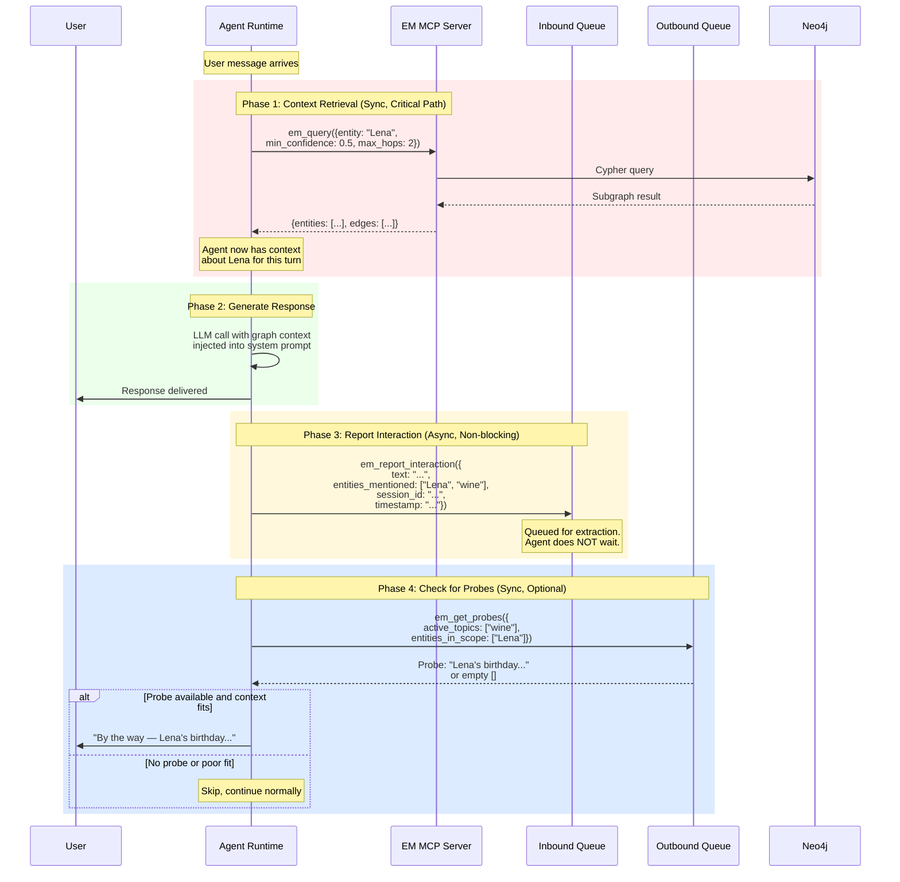

#### 2.2 Failure Modes and Fallbacks

Every integration point must have a defined failure mode. Experience Memory is an enhancement, not a dependency — the agent must always be able to respond even if EM is completely down.

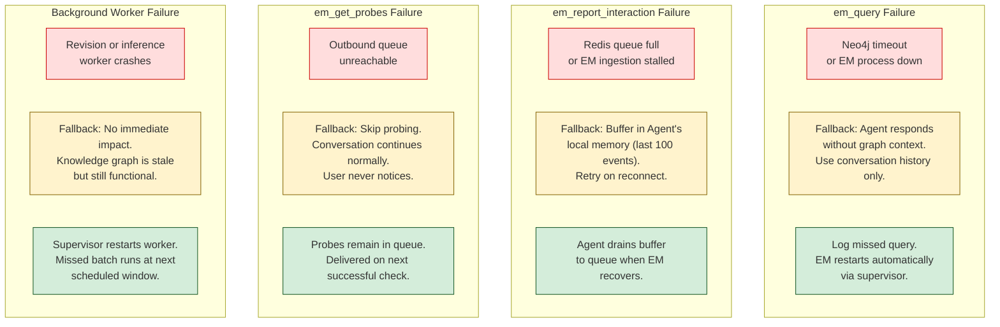

| Integration Point          | Failure Impact                                   | User Visible?                            | Recovery                                     |
| -------------------------- | ------------------------------------------------ | ---------------------------------------- | -------------------------------------------- |
| `em_query` timeout         | Agent responds without graph context             | Subtle — less personalized response      | Auto-retry next turn                         |
| `em_query` returns empty   | Agent has no knowledge about topic               | Subtle — behaves like new agent          | Normal — graph may not have data yet         |
| Inbound queue full         | Interactions not processed, graph stops learning | No                                       | Buffer in agent, drain on recovery           |
| Inbound queue slow         | Extraction delayed, probes arrive late           | No                                       | Queue catches up during idle                 |
| Outbound queue unreachable | No probes or starters delivered                  | No — agent just doesn't probe            | Probes accumulate, delivered on recovery     |
| Neo4j down                 | All graph queries fail                           | Yes — no personalization                 | Supervisor restarts, agent uses fallback     |
| Small LLM down             | Extraction pipeline stalls                       | No (async)                               | Queue buffers, processes on recovery         |
| Large LLM down             | Inference and synthesis stall                    | No (background)                          | Retries at next scheduled window             |
| Redis down                 | All queues fail                                  | Partial — no probes, interactions buffer | Supervisor restarts, agents use local buffer |

#### 2.3 Context Injection into Agent's LLM Prompt

When the Agent Runtime queries Experience Memory, the results need to be formatted and injected into the LLM's context. This is where the graph becomes actionable.

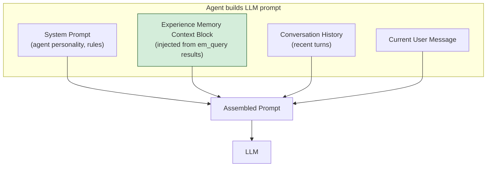

**Context block format** — structured, concise, confidence-annotated:

```
<experience_context>
  <entity name="Lena" relation="wife">
    <fact confidence="0.90" type="trait">Likes flowers</fact>
    <fact confidence="0.90" type="trait">Likes postcards</fact>
    <fact confidence="0.85" type="trait">Prefers red wine, especially Malbec</fact>
    <fact confidence="0.55" type="wish" expires="2026-12">May want a new kitchen chair set</fact>
    <fact confidence="0.99" type="state">Birthday: December 2</fact>
  </entity>
  <pending_probe topic="wine" priority="0.85">
    Lena's birthday is ~1 month away. Knowledge gap: does she enjoy wine subscriptions?
  </pending_probe>
  <active_reminders>
    Birthday reminder for Lena: fires November 25
  </active_reminders>
</experience_context>
```

The agent's system prompt includes instructions on how to use this context: prefer high-confidence facts, hedge when using low-confidence facts, never reveal raw confidence scores to the user, and integrate probes naturally into conversation when context fits.

---

### 3. Session Manager ↔ Experience Memory

The Session Manager routes messages from channel adapters to the Agent Runtime. It also provides session metadata that Experience Memory needs for context.

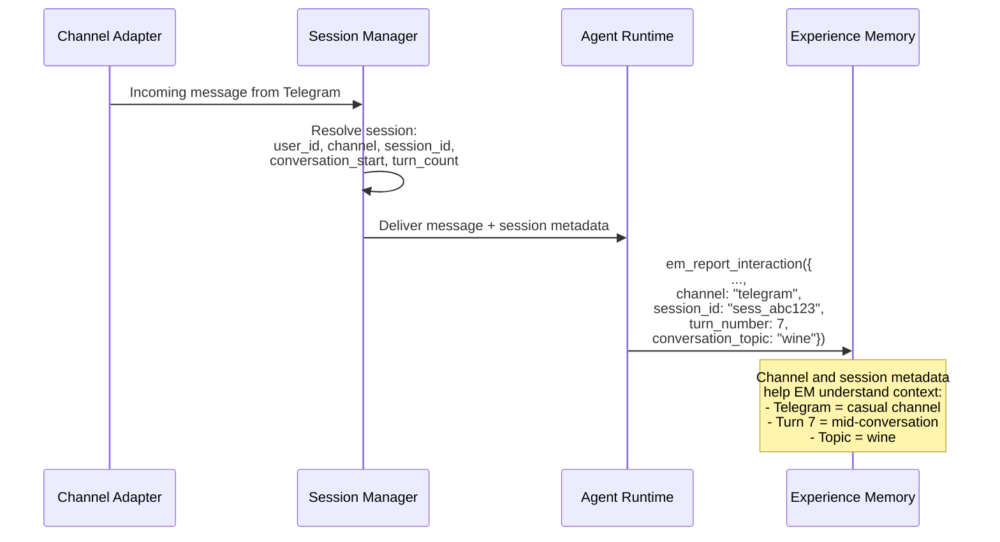

| Session Metadata     | Used By EM For                                                      |
| -------------------- | ------------------------------------------------------------------- |
| `channel`            | Adjusting probe formality (Slack = professional, Telegram = casual) |
| `session_id`         | Grouping interactions into episodes                                 |
| `turn_number`        | Determining if now is appropriate for probing (not turn 1)          |
| `conversation_start` | Calculating conversation duration for episode records               |
| `user_timezone`      | Scheduling starters and revision delivery                           |
| `user_locale`        | Language and cultural context for probes                            |

---

### 4. Skill Orchestrator ↔ Experience Memory

Skills (MCP servers) don't talk to Experience Memory directly — they're sandboxed. But the Skill Orchestrator reports skill outcomes to EM, and EM can influence which skills get invoked and how.

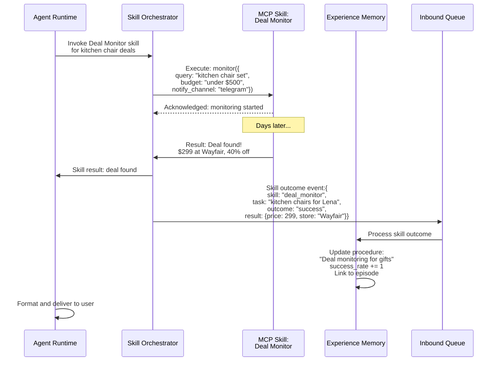

#### Experience Memory Informing Skill Invocation

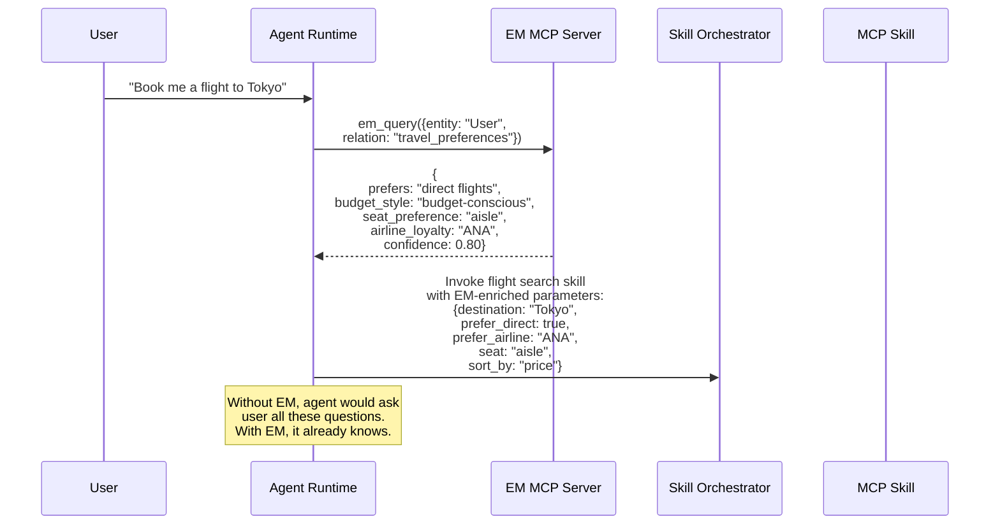

---

### 5. Control UI and Studio ↔ Experience Memory

The Control UI provides the user-facing interface for graph inspection, and Studio needs EM context for workflow design.

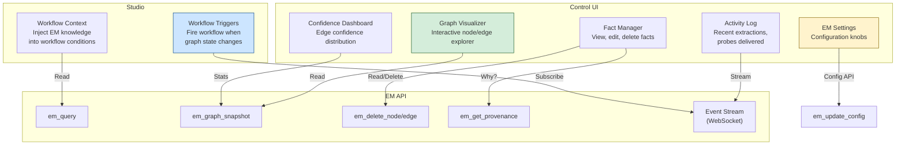

#### Studio Workflow Trigger Example

A user designs a workflow in Studio: "When someone I know has a birthday within 14 days AND I don't have a gift planned, start the gift research procedure."

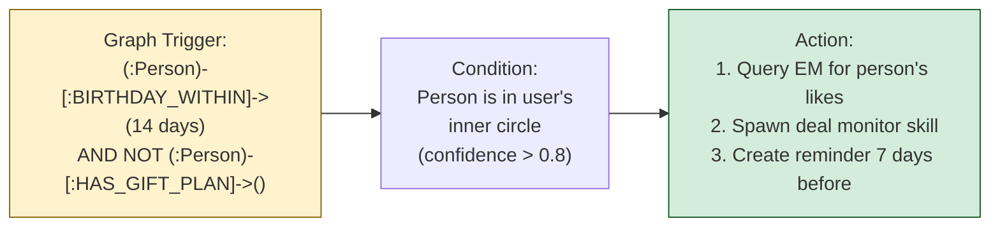

---

### 6. Voice Pipeline ↔ Experience Memory

The STT-TTS pipeline introduces unique challenges: speech is noisier than text, and voice conversations tend to be more casual and faster-paced.

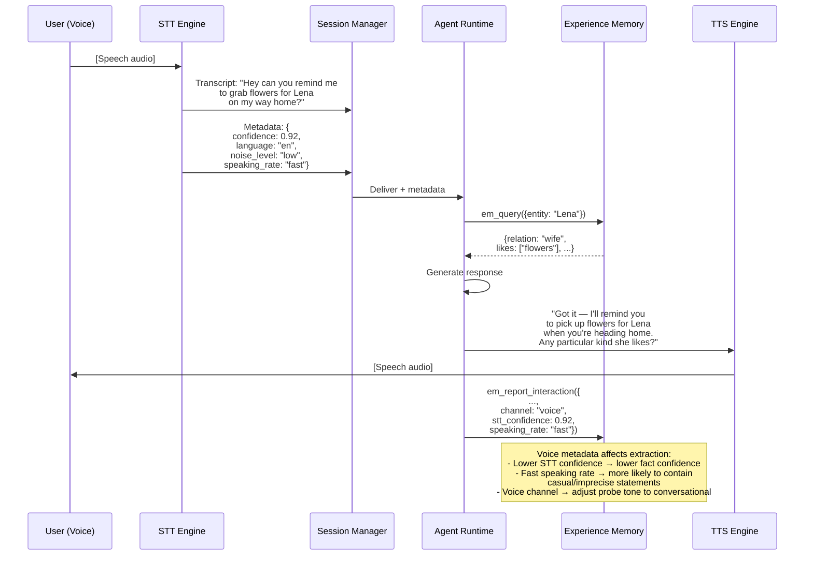

| Voice-Specific Consideration       | How EM Handles It                                                    |
| ---------------------------------- | -------------------------------------------------------------------- |
| STT transcription errors           | Reduce extraction confidence proportionally to STT confidence score  |
| Casual/imprecise language          | Widen hedging detection thresholds                                   |
| Faster conversation pace           | Reduce probe frequency (1 per 5 turns instead of 1 per conversation) |
| No visual UI available             | Probes must be short and conversational                              |
| Ambient context (driving, cooking) | Adjust starter urgency thresholds based on detected activity         |

---

### 7. Event Sources ↔ Experience Memory

The Event Monitor polls external sources and cross-references against the knowledge graph. Integration points:

| Event Source                              | Polling Method                | Data Format                          | Relevance Filter                                 |
| ----------------------------------------- | ----------------------------- | ------------------------------------ | ------------------------------------------------ |
| **Weather API**                           | REST poll every 30 min        | JSON (location, severity, timeframe) | Match against user's `lives_in`, `planning`      |
| **News API**                              | REST poll every 15 min        | JSON (headlines, topics, entities)   | Match against user's `interested_in`, `works_at` |
| **Market data**                           | WebSocket stream (if enabled) | JSON (ticker, price, change)         | Match against user's `invested_in`, `tracks`     |
| **Calendar** (user's own)                 | CalDAV sync every 5 min       | iCal events                          | Upcoming events within N-day lookahead           |
| **Email digest** (if email skill enabled) | Skill reports summaries       | Structured JSON                      | Match against known entities and active tasks    |

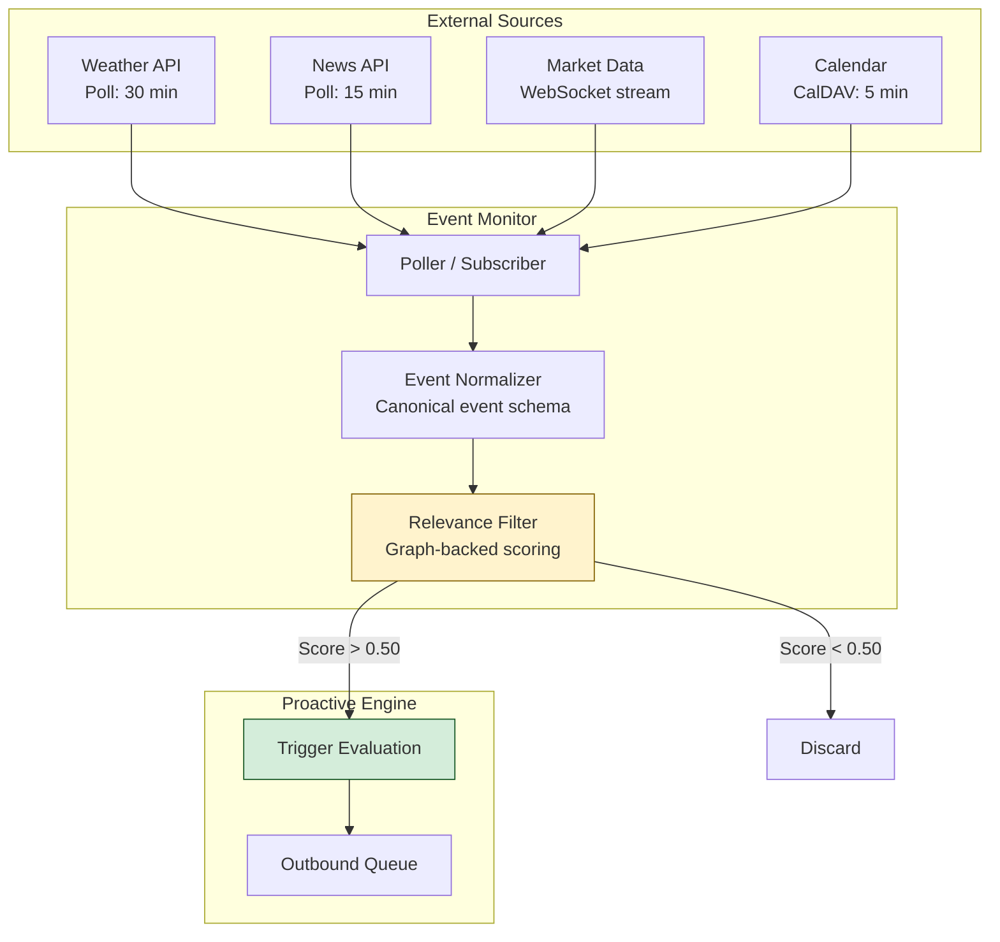

---

## Part II: Testing Strategy

---

### 8. Testing Pyramid

Experience Memory requires testing at five levels, each catching different classes of bugs.

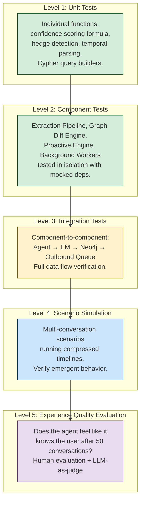

---

### 9. Level 1 — Unit Tests

| Component             | Test Focus             | Example Test Cases                                                 |
| --------------------- | ---------------------- | ------------------------------------------------------------------ |
| **Confidence scorer** | Formula correctness    | `explicit + no_hedge + strong_sentiment = 0.90 × 1.0 × 1.0 = 0.90` |
|                       |                        | `inferred + moderate_hedge + neutral = 0.45 × 0.65 × 0.80 = 0.234` |
|                       | Boundary conditions    | `confidence never exceeds 1.0 after reinforcement`                 |
|                       |                        | `confidence never goes below 0.0 after decay`                      |
| **Hedge detector**    | Keyword classification | `"loves" → no_hedge`, `"may like" → moderate_hedge`                |
|                       | Edge cases             | `"I don't think she hates it" → complex negation handling`         |
| **Temporal parser**   | Type classification    | `"this year" → wish, expires: 2026-12-31`                          |
|                       |                        | `"always" → trait, no expiry`                                      |
|                       |                        | `"last Tuesday" → episode, occurred_at: 2026-02-10`                |
|                       | Relative dates         | `"next month" → correct absolute date`                             |
| **Confidence decay**  | Math correctness       | `0.85 × (1 - 0.01) = 0.8415 after 1 cycle`                         |
|                       |                        | `Edge archived when confidence < 0.15`                             |
| **Cypher builders**   | Query correctness      | `query_entity("Lena", min_confidence=0.5)` → valid Cypher          |
|                       | Injection safety       | `entity name with quotes/special chars → escaped`                  |

**Test count target:** ~200 unit tests covering all formula paths and edge cases.

---

### 10. Level 2 — Component Tests

Each major component tested in isolation with mocked dependencies.

#### 10.1 Extraction Pipeline Tests

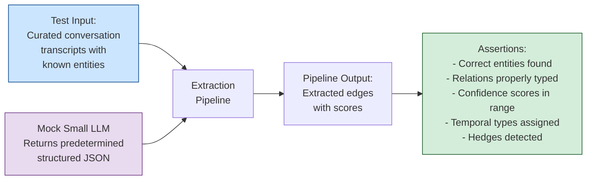

**Test corpus structure:**

| Category               | Input Example                                                           | Expected Extraction                                                              |
| ---------------------- | ----------------------------------------------------------------------- | -------------------------------------------------------------------------------- |
| **Explicit fact**      | "My wife's name is Lena"                                                | Person(Lena) →wife_of→ User, confidence: 0.90                                    |
| **Hedged preference**  | "She may like kitchen chairs"                                           | Lena →may_want→ Kitchen chairs, confidence: 0.55, type: wish                     |
| **Strong preference**  | "She absolutely loves Malbec"                                           | Lena →loves→ Malbec, confidence: 0.95, type: trait                               |
| **Negation**           | "She doesn't drink beer"                                                | Lena →dislikes→ Beer, confidence: 0.85, type: trait                              |
| **Indirect inference** | "Pick up the kids from school"                                          | User →has_children→ Children, confidence: 0.85, source: inference                |
| **Temporal**           | "We're going to Tokyo in March"                                         | User →planning→ Tokyo trip, type: wish, dates: March 2026                        |
| **Contradiction**      | "Actually she's turning 46, not 47"                                     | Correction: Lena →age→ 46, revise previous                                       |
| **No new info**        | "Thanks, that's helpful"                                                | No graph mutation                                                                |
| **Complex sentence**   | "My wife would kill me if I forgot again, she's turning 47 in December" | Multiple: relationship confirmed, negative episode, age inferred, birthday month |

**Minimum test corpus: 100 labeled examples** across all categories, with at least 10 per category.

#### 10.2 Graph Diff Engine Tests

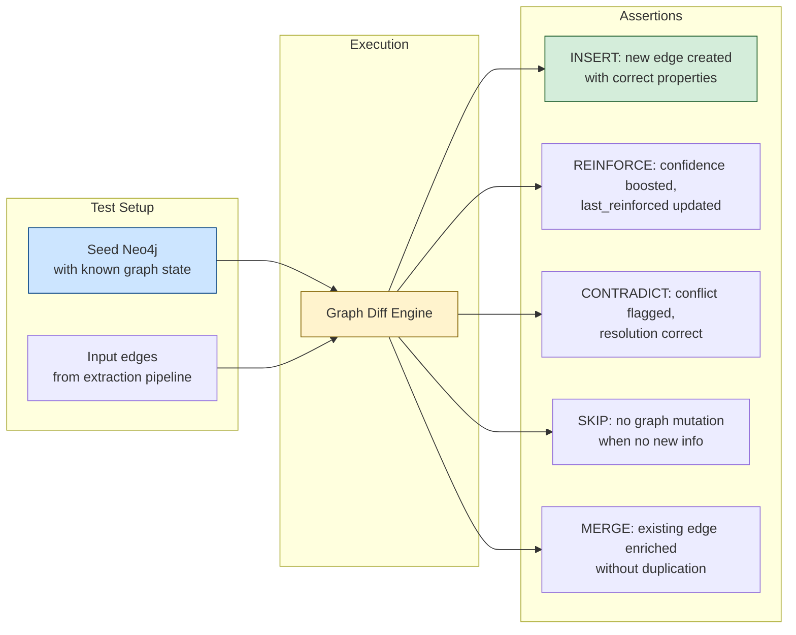

| Scenario                   | Seed State                       | Input                          | Expected Operation                     |
| -------------------------- | -------------------------------- | ------------------------------ | -------------------------------------- |
| Brand new entity           | Empty graph                      | Lena →wife_of→ User            | INSERT both nodes + edge               |
| Known entity, new relation | Lena exists                      | Lena →likes→ Malbec            | INSERT edge only                       |
| Reinforcement              | Lena →likes→ Flowers (0.70)      | Lena →likes→ Flowers (0.90)    | REINFORCE: confidence → 0.82           |
| Contradiction              | Lena →age→ 47 (0.80)             | Lena →age→ 46 (0.90)           | CONTRADICT → REVISE to 46              |
| More specific              | Lena →likes→ Wine (0.85)         | Lena →prefers→ Malbec (0.85)   | MERGE: add specific edge, keep general |
| Duplicate                  | Lena →wife_of→ User (0.95)       | Lena →wife_of→ User (0.90)     | REINFORCE (not duplicate)              |
| Expired wish               | Kitchen chairs (expired 2025-12) | Kitchen chairs mentioned again | INSERT new wish with new expiry        |

#### 10.3 Proactive Engine Tests

| Scenario                     | Input Trigger                        | Graph State                             | Expected Output                         |
| ---------------------------- | ------------------------------------ | --------------------------------------- | --------------------------------------- |
| **Auto-execute**             | DOB discovered                       | Lena DOB: Dec 2 (0.99)                  | Auto-create birthday reminder           |
| **Suggest, high confidence** | Deal found for known interest        | Lena →likes→ Malbec (0.90) + deal       | Suggestion in outbound queue            |
| **Suggest, low confidence**  | Deal found for hedged wish           | Lena →may_want→ Chairs (0.55) + deal    | Casual suggestion in queue              |
| **Defer**                    | Possible gift idea, low confidence   | Lena →may_want→ something (0.30)        | Defer, queue for reinforcement          |
| **Probe generated**          | Knowledge gap + matching context     | wine conversation + no wife wine pref   | Probe in outbound queue                 |
| **Probe suppressed**         | Knowledge gap + no matching context  | coding conversation + no wife wine pref | Probe stays in queue                    |
| **Frequency limit**          | 3 probes already delivered this week | Any trigger                             | Suppress, respect limit                 |
| **Timing suppressed**        | Good probe, but 2am user time        | Any trigger                             | Queue with earliest_delivery constraint |

---

### 11. Level 3 — Integration Tests

Full data flow tests with real Neo4j (test instance) and real Redis, but mocked LLMs.

```mermaid
graph TB
    subgraph Test Harness
        DRIVER["Test Driver<br/>Simulates agent interactions"]
        MOCK_AG["Mock Agent Runtime<br/>Sends interactions,<br/>pulls probes"]
    end

    subgraph Real Services (Dockerized)
        EM["Experience Memory<br/>Service"]
        NEO_T["Neo4j<br/>(test instance)"]
        REDIS_T["Redis<br/>(test instance)"]
        VEC_T["Vector Store<br/>(test instance)"]
    end

    subgraph Mocked Services
        LLM_MOCK["LLM Mock Server<br/>Deterministic responses<br/>from test corpus"]
    end

    DRIVER --> MOCK_AG
    MOCK_AG --> EM
    EM --> NEO_T
    EM --> REDIS_T
    EM --> VEC_T
    EM --> LLM_MOCK

    DRIVER -->|"Assert graph state"| NEO_T
    DRIVER -->|"Assert queue contents"| REDIS_T

    style DRIVER fill:#cce5ff,stroke:#004085
    style NEO_T fill:#d4edda,stroke:#155724
    style REDIS_T fill:#d4edda,stroke:#155724
    style LLM_MOCK fill:#e8daef,stroke:#6c3483
```

#### Integration Test Scenarios

| Test Name                         | Steps                                                   | Assertions                                                |
| --------------------------------- | ------------------------------------------------------- | --------------------------------------------------------- |
| **Full extraction flow**          | Send 1 interaction → wait for extraction → check graph  | Correct nodes/edges in Neo4j                              |
| **Reinforcement over 3 turns**    | Send 3 interactions mentioning same preference          | Edge confidence increases monotonically                   |
| **Contradiction and revision**    | Send fact, then contradicting fact                      | Old edge revised, new edge created with higher confidence |
| **Probe generation and delivery** | Create knowledge gap, send matching-context interaction | Probe appears in outbound queue with correct context tags |
| **Probe delivery timing**         | Create probe, send 5 interactions with wrong context    | Probe NOT delivered until matching context                |
| **Background decay**              | Seed edges, trigger decay worker                        | Confidence decreased by correct amount                    |
| **Background archival**           | Seed low-confidence edges, trigger archival             | Edges below threshold removed                             |
| **Inference chain**               | Seed multi-hop graph, trigger inference worker          | New low-confidence edges created connecting distant nodes |
| **Event-driven starter**          | Seed graph with location + event, inject weather alert  | Starter in outbound queue with correct timing constraints |
| **Skill outcome reporting**       | Simulate skill completion event                         | Episode created, procedure success_rate updated           |
| **Failure recovery**              | Kill Neo4j mid-extraction, restart                      | Extraction retries, no data loss, agent buffer drained    |

**Test infrastructure:** Docker Compose with Neo4j, Redis, Vector Store, LLM mock server. Tests run in CI on every PR.

---

### 12. Level 4 — Scenario Simulation

This is the critical testing level. We need to verify that Experience Memory produces the right *emergent behavior* over time, not just correct individual operations.

#### 12.1 Scenario Simulator

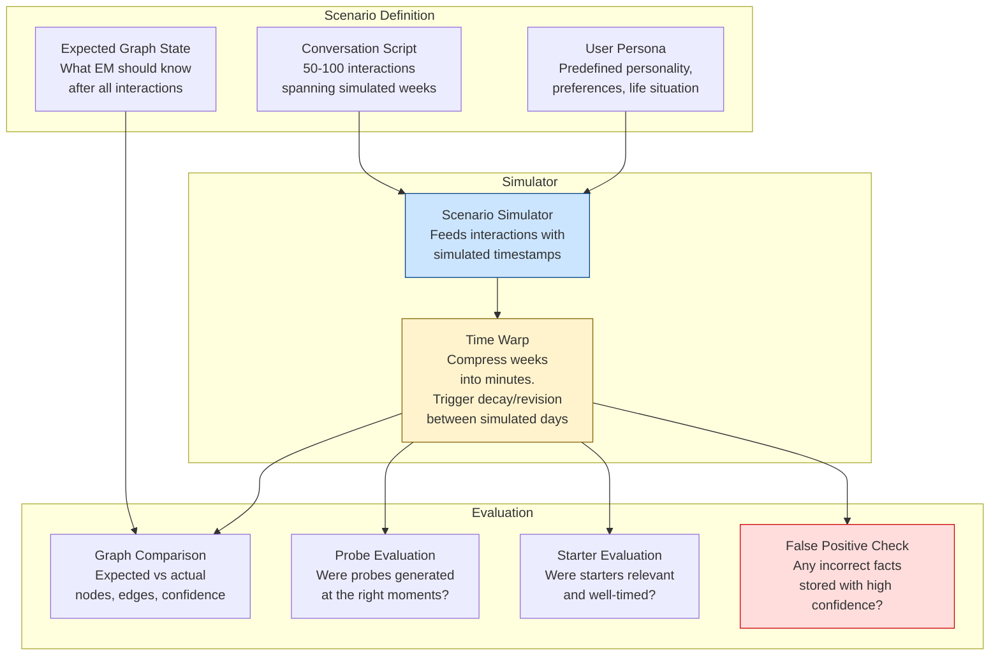

#### 12.2 Test Personas

| Persona                 | Profile                                                                              | Key Test Focus                                                         |
| ----------------------- | ------------------------------------------------------------------------------------ | ---------------------------------------------------------------------- |
| **Alex the CTO**        | Married (Lena), 2 kids, works at FinTech startup, codes in Python, travels quarterly | Full lifecycle: family, work, coding preferences, travel patterns      |
| **Maya the Freelancer** | Single, graphic designer, multiple clients, irregular schedule, budget-conscious     | Temporal patterns with irregular hours, multi-client context switching |
| **James the Retiree**   | Widower, hobby gardener, follows markets, has grandchildren, less tech-savvy         | Gentle probing, simpler language, health/wellness sensitivity          |
| **Sara the Student**    | University, part-time job, roommates, limited budget, social media active            | Fast-changing interests, budget constraints, social context            |

#### 12.3 Scenario Script Example — "Alex the CTO"

```
# Week 1
Turn 1: "Help me write a Python script to parse CSV files"
  → EM should extract: User prefers Python (explicit)
Turn 2: "Use type hints please, I hate untyped code"
  → EM should extract: strong preference for type hints (explicit, high confidence)
Turn 3: "Can you move my Thursday standup to Friday?"
  → EM should infer: has recurring standup (indirect inference)

# Week 2
Turn 4: "I want to buy a present for my wife"
  → EM should detect: knowledge gap about wife
Turn 5: "Her name is Lena. Birthday is December 2, 1979"
  → EM should create: Person(Lena), wife relation, DOB
  → EM should auto-suggest: birthday reminder
Turn 6: "She likes flowers and postcards. Maybe kitchen chairs this year"
  → EM should create: traits (flowers, postcards) + wish (chairs)
  → EM should spawn: deal monitoring if skill available

# Week 3
Turn 7: [wine conversation]
  → EM should surface probe: "Does Lena enjoy wine?"
Turn 8: "She loves reds, especially Malbec"
  → EM should create: wine/Malbec preferences for Lena

# Week 4 (simulated) — Background revision runs
  → EM should verify: Acme Corp still exists (public fact)
  → EM should run inference: Malbec → Argentina → user's travel interest?
  → EM should decay: any edges not reinforced

# Week 5
Turn 9: "We're planning a trip to Tokyo in March"
  → EM should create: Tokyo trip, March dates
  → EM should enrich: travel preferences from past patterns
Turn 10: "Book direct flights, I always prefer direct"
  → EM should reinforce: direct flight preference
```

#### 12.4 Evaluation Metrics

| Metric                                                                  | Target                   | Measurement                                      |
| ----------------------------------------------------------------------- | ------------------------ | ------------------------------------------------ |
| **Precision** — facts stored are correct                                | > 95%                    | Compare graph to ground truth persona            |
| **Recall** — facts mentioned are captured                               | > 85%                    | Count of expected facts found in graph           |
| **Confidence calibration** — confidence scores match actual correctness | Calibration error < 0.10 | Compare confidence to binary correct/incorrect   |
| **False positive rate** — incorrect facts stored at high confidence     | < 2%                     | Count of wrong facts with confidence > 0.70      |
| **Probe relevance** — probes generated at appropriate moments           | > 80% relevant           | Human evaluation of probe timing and context fit |
| **Probe naturalness** — probes feel conversational, not interrogative   | > 85% natural            | Human evaluation / LLM-as-judge                  |
| **Inference accuracy** — overnight inferences are reasonable            | > 60% useful             | Human evaluation of inferred connections         |
| **Contradiction handling** — corrections properly applied               | 100%                     | All explicit corrections reflected in graph      |

---

### 13. Level 5 — Experience Quality Evaluation

The highest-level test: does the agent *feel* like it knows the user?

#### 13.1 LLM-as-Judge Evaluation

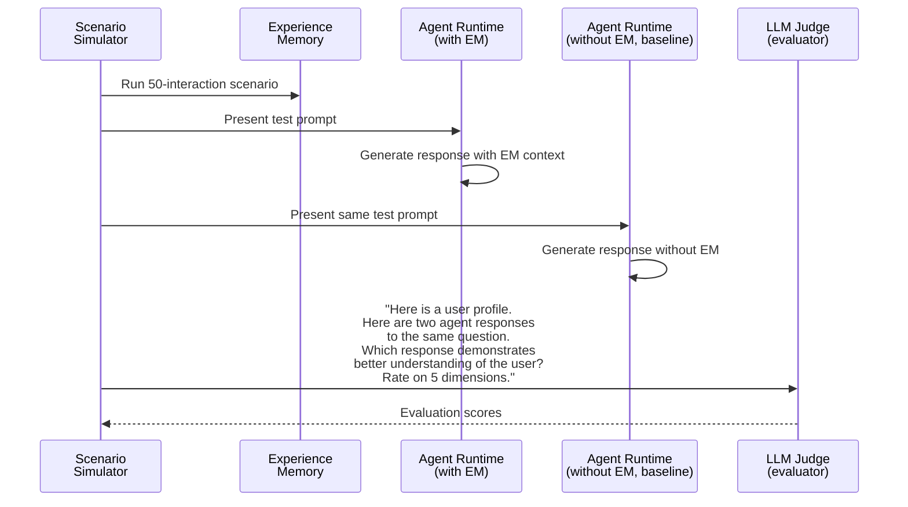

#### 13.2 Evaluation Dimensions

| Dimension           | What It Measures                                          | Example                                                   |
| ------------------- | --------------------------------------------------------- | --------------------------------------------------------- |
| **Personalization** | Does the response reflect user's known preferences?       | Agent suggests Python with type hints without being asked |
| **Anticipation**    | Does the agent predict needs before being asked?          | Agent mentions upcoming birthday during gift conversation |
| **Consistency**     | Does the agent maintain coherent knowledge across topics? | Wife's name is always Lena, never confused                |
| **Naturalness**     | Do probes and suggestions feel organic?                   | Wine → birthday probe feels like a thoughtful friend      |
| **Restraint**       | Does the agent avoid overstepping or being creepy?        | Agent doesn't volunteer private info unprompted           |

#### 13.3 A/B Comparison Framework

| Test                              | Agent A (with EM)                     | Agent B (baseline)                  | Evaluator             |
| --------------------------------- | ------------------------------------- | ----------------------------------- | --------------------- |
| Same-session personalization      | Uses graph context                    | Uses conversation history only      | LLM judge             |
| Cross-session knowledge           | Remembers facts from weeks ago        | Each session starts fresh           | LLM judge             |
| Proactive suggestions             | Offers birthday reminder, deal alerts | Only responds to explicit requests  | Human evaluation      |
| Preference-aware skill invocation | Passes EM preferences to skills       | Asks user every time                | Task completion speed |
| Error recovery after correction   | Updates graph, never repeats mistake  | May repeat error in future sessions | Correctness tracking  |

---

## Part III: Configuration

---

### 14. Configuration Philosophy

**Sensible defaults. Minimal required configuration. Expert overrides available.**

The configuration is organized into three tiers:

| Tier         | Audience                 | Changed When                                | Examples                                                  |
| ------------ | ------------------------ | ------------------------------------------- | --------------------------------------------------------- |
| **Defaults** | Nobody (baked in)        | Never by user, only by SecretAI engineering | Confidence formula weights, graph schema                  |
| **Profile**  | Every user (on setup)    | During onboarding or in Settings            | Timezone, language, preferred channels, proactivity level |
| **Expert**   | Power users / developers | Via Control UI or config file               | Decay rates, probe frequency, inference schedule          |

---

### 15. Configuration Schema

```yaml
# experience_memory.yaml
# SecretAI Rails — Experience Memory Configuration

# ============================================================
# PROFILE TIER — User-facing settings
# ============================================================
profile:
  # User timezone — affects scheduling of starters, revision, probes
  timezone: "America/Los_Angeles"
  
  # Primary language for probe generation
  language: "en"
  
  # How proactive should the agent be?
  # conservative: Only suggest when explicitly relevant, minimal probing
  # balanced: Contextual probes, moderate starters (DEFAULT)
  # proactive: Frequent probes, more conversation starters, anticipatory
  proactivity_level: "balanced"
  
  # Channels where agent may initiate conversation (starters)
  # Agent will never initiate on channels not listed here
  starter_channels:
    - "telegram"
    - "whatsapp"
  
  # Do Not Disturb hours — no agent-initiated contact
  quiet_hours:
    start: "22:00"
    end: "07:00"
  
  # Should the agent explain why it knows something when asked?
  # If false, agent says "I remember from our conversations"
  # If true, agent traces provenance chain
  explain_knowledge: true

# ============================================================
# EXTRACTION — Controls how facts are extracted from conversation
# ============================================================
extraction:
  # Enable/disable indirect inference (Pattern 4)
  # Some users may prefer only explicit fact storage
  enable_indirect_inference: true
  
  # Minimum confidence threshold for storing an extracted fact
  # Below this, the extraction is discarded
  min_storage_confidence: 0.25
  
  # Maximum entities to extract per message
  # Prevents runaway extraction on very long messages
  max_entities_per_message: 20
  
  # Maximum relations to extract per message
  max_relations_per_message: 30
  
  # Enable/disable sentiment analysis on extractions
  enable_sentiment: true
  
  # STT confidence multiplier — reduce extraction confidence
  # when speech-to-text confidence is low
  stt_confidence_floor: 0.70  # Below this STT score, skip extraction entirely
  stt_confidence_scale: true  # Scale extraction confidence by STT confidence

# ============================================================
# CONFIDENCE — Controls the confidence scoring model
# ============================================================
confidence:
  # Base confidence scores by acquisition mechanism
  base_scores:
    explicit: 0.90    # User directly states a fact
    observational: 0.65 # Pattern detected from behavior
    inferential: 0.45   # Cross-context inference
    reflective: 0.50    # Default for outcome-based learning
  
  # Hedge multipliers
  hedge_multipliers:
    none: 1.00          # "loves", "always"
    mild: 0.90          # "likes", "usually"
    moderate: 0.65       # "may", "might"
    strong: 0.50         # "I think", "maybe", "possibly"
  
  # Reinforcement boost per additional episode
  reinforcement_boost: 0.08
  
  # Maximum confidence (hard cap)
  max_confidence: 0.99
  
  # Minimum confidence before archival
  archive_threshold: 0.15
  
  # Trait edges have a slower decay (protected)
  trait_decay_protection: 0.5  # Multiply decay rate by this for traits

# ============================================================
# DECAY — Controls how knowledge ages
# ============================================================
decay:
  # Default decay rate per cycle (monthly)
  default_rate: 0.02  # 2% per month
  
  # Decay rates by temporal type (override default)
  rates_by_type:
    trait: 0.005        # Very slow — near-permanent
    state: 0.00         # No time decay, only contradictions
    wish: 0.04          # Faster decay — time-bounded desires
    episode: 0.08       # Fast decay — one-time events
  
  # Decay cycle frequency
  cycle_frequency: "weekly"  # "daily" | "weekly" | "monthly"
  
  # Grace period — no decay for N days after last reinforcement
  grace_period_days: 30

# ============================================================
# PROBING — Controls contextual probing behavior
# ============================================================
probing:
  # Maximum probes per conversation
  max_probes_per_conversation: 1
  
  # Maximum probes per day
  max_probes_per_day: 3
  
  # Maximum probes per week
  max_probes_per_week: 10
  
  # Minimum conversation turn before probing
  # Don't probe in the first N turns of a conversation
  min_turn_for_probe: 3
  
  # Minimum context-fit score to deliver a probe
  min_context_fit: 0.70
  
  # Retry limit — after N failed context matches, lower priority
  max_probe_attempts: 5
  
  # Cooldown after user ignores a probe (days)
  ignore_cooldown_days: 7
  
  # Cooldown after user deflects a probe (days)
  deflect_cooldown_days: 14

# ============================================================
# STARTERS — Controls agent-initiated conversations
# ============================================================
starters:
  # Enable/disable conversation starters entirely
  enabled: true
  
  # Maximum starters per day (across all types)
  max_per_day: 3
  
  # Maximum starters per week
  max_per_week: 10
  
  # Minimum relevance score to initiate contact
  min_relevance: 0.50
  
  # Per-type limits and settings
  types:
    alert:
      enabled: true
      max_per_day: 5          # Alerts can exceed normal limits
      min_relevance: 0.40     # Lower threshold for safety-related
      override_quiet_hours: true  # Weather warnings during DND
    
    opportunity:
      enabled: true
      max_per_day: 2
      min_relevance: 0.60
      override_quiet_hours: false
    
    revision:
      enabled: true
      max_per_day: 1
      min_relevance: 0.50
      override_quiet_hours: false
    
    insight:
      enabled: true
      max_per_week: 2         # Weekly limit, not daily
      min_relevance: 0.70
      override_quiet_hours: false
    
    anticipation:
      enabled: true
      lookahead_days: 10      # How far ahead to check
      min_relevance: 0.50
      override_quiet_hours: false

# ============================================================
# RISK MODEL — Controls proactive suggestion thresholds
# ============================================================
risk_model:
  # Auto-execute threshold: high confidence AND low cost
  auto_execute:
    min_confidence: 0.90
    max_cost_category: "none"  # "none" | "low" | "medium" | "high"
  
  # Suggest threshold: moderate+ confidence AND low-medium cost
  suggest:
    min_confidence: 0.50
    max_cost_category: "medium"
  
  # Casual mention threshold: any confidence, low cost
  casual_mention:
    min_confidence: 0.30
    max_cost_category: "low"
  
  # Defer threshold: everything else
  # (implicit — anything not matching above is deferred)
  
  # Cost categories for action types
  action_costs:
    create_reminder: "none"
    suggest_product: "low"
    spawn_monitoring_task: "low"
    send_message_on_behalf: "high"
    make_purchase: "high"
    modify_calendar: "medium"
    share_information: "medium"

# ============================================================
# BACKGROUND — Controls revision and inference workers
# ============================================================
background:
  # Revision schedule (cron syntax, in user's timezone)
  revision_schedule: "0 2 * * *"    # 2:00 AM daily
  
  # Inference schedule
  inference_schedule: "0 3 * * *"   # 3:00 AM daily
  
  # Episode clustering schedule
  clustering_schedule: "0 4 * * 0"  # 4:00 AM Sundays
  
  # Maximum revision batch size (edges per run)
  revision_batch_size: 100
  
  # Maximum inference chain depth (hops)
  max_inference_depth: 3
  
  # Maximum inferred edges per run
  max_inferred_edges: 20
  
  # Public fact verification — use web search to verify
  enable_public_fact_verification: true
  
  # Maximum web searches per revision cycle
  max_verification_searches: 10

# ============================================================
# EVENT MONITOR — Controls external event monitoring
# ============================================================
event_monitor:
  # Enable/disable entire event monitoring
  enabled: true
  
  # Source-specific settings
  sources:
    weather:
      enabled: true
      poll_interval_minutes: 30
      severity_threshold: "warning"  # "watch" | "warning" | "emergency"
    
    news:
      enabled: true
      poll_interval_minutes: 15
      max_articles_per_poll: 20
    
    market:
      enabled: false             # Opt-in only
      # poll_interval_minutes: 5
      # change_threshold_percent: 2.0
    
    calendar:
      enabled: true
      sync_interval_minutes: 5
      lookahead_days: 14

# ============================================================
# LLM — Controls LLM usage for extraction and inference
# ============================================================
llm:
  # Small LLM for extraction pipeline
  small:
    provider: "anthropic"       # "anthropic" | "openai" | "local"
    model: "claude-haiku-4-5-20251001"
    max_tokens: 1024
    temperature: 0.1            # Low for structured extraction
    timeout_ms: 2000
    retry_count: 2
    fallback: "skip"            # "skip" | "queue_retry" — what to do on failure
  
  # Large LLM for inference and synthesis
  large:
    provider: "anthropic"
    model: "claude-sonnet-4-5-20250929"
    max_tokens: 4096
    temperature: 0.3            # Slightly higher for creative inference
    timeout_ms: 30000
    retry_count: 1
    fallback: "queue_retry"
  
  # Token budget limits (per day)
  daily_token_budget:
    small: 500000              # ~500K tokens/day for extraction
    large: 100000              # ~100K tokens/day for inference

# ============================================================
# STORAGE — Controls graph database and vector store
# ============================================================
storage:
  neo4j:
    uri: "bolt://localhost:7687"
    database: "experience_memory"
    max_connections: 20
    query_timeout_ms: 5000
    
  vector_store:
    provider: "qdrant"          # "qdrant" | "chroma"
    uri: "http://localhost:6333"
    collection: "episodes"
    embedding_model: "text-embedding-3-small"
    embedding_dimensions: 1536
    
  queue:
    provider: "redis"           # "redis" | "nats"
    uri: "redis://localhost:6379"
    inbound_queue: "em:inbound"
    outbound_queue: "em:outbound"
    max_queue_size: 10000
    ttl_hours: 72               # Messages expire after 72h

# ============================================================
# PRIVACY — Controls data classification and sharing
# ============================================================
privacy:
  # Enable/disable experience sharing with other agents
  sharing_enabled: false        # Opt-in only
  
  # Minimum privacy level for shared data
  sharing_min_level: "L1"       # Only L0 and L1 shared
  
  # Enable/disable differential privacy on exports
  differential_privacy: true
  
  # Epsilon for differential privacy (lower = more private)
  dp_epsilon: 1.0
  
  # Auto-classify PII in extracted entities
  auto_pii_detection: true
  
  # Retention period for archived (low-confidence) edges
  archive_retention_days: 365

# ============================================================
# OBSERVABILITY — Controls metrics and logging
# ============================================================
observability:
  # Metrics export
  metrics:
    enabled: true
    export_interval_seconds: 60
    endpoint: "http://localhost:9090/metrics"  # Prometheus
  
  # Audit logging
  audit_log:
    enabled: true
    log_extractions: true       # Log every extraction operation
    log_graph_mutations: true   # Log every INSERT/REINFORCE/CONTRADICT
    log_probes_delivered: true  # Log every probe sent to user
    log_starters_delivered: true
    retention_days: 90
  
  # Health check
  health_check:
    interval_seconds: 30
    neo4j_timeout_ms: 1000
    redis_timeout_ms: 500
    vector_store_timeout_ms: 1000
```

---

### 16. Configuration Profiles — Proactivity Presets

The `proactivity_level` setting maps to a coherent set of overrides:

| Setting                                  | Conservative | Balanced (Default) | Proactive |
| ---------------------------------------- | ------------ | ------------------ | --------- |
| `probing.max_probes_per_conversation`    | 0            | 1                  | 2         |
| `probing.max_probes_per_week`            | 3            | 10                 | 20        |
| `probing.min_context_fit`                | 0.90         | 0.70               | 0.50      |
| `probing.min_turn_for_probe`             | 5            | 3                  | 2         |
| `starters.enabled`                       | false        | true               | true      |
| `starters.max_per_day`                   | 0            | 3                  | 5         |
| `starters.max_per_week`                  | 0            | 10                 | 25        |
| `starters.min_relevance`                 | N/A          | 0.50               | 0.35      |
| `extraction.enable_indirect_inference`   | false        | true               | true      |
| `background.max_inferred_edges`          | 0            | 20                 | 50        |
| `risk_model.auto_execute.min_confidence` | 0.99         | 0.90               | 0.80      |

Users select a preset during onboarding. Power users can override individual settings.

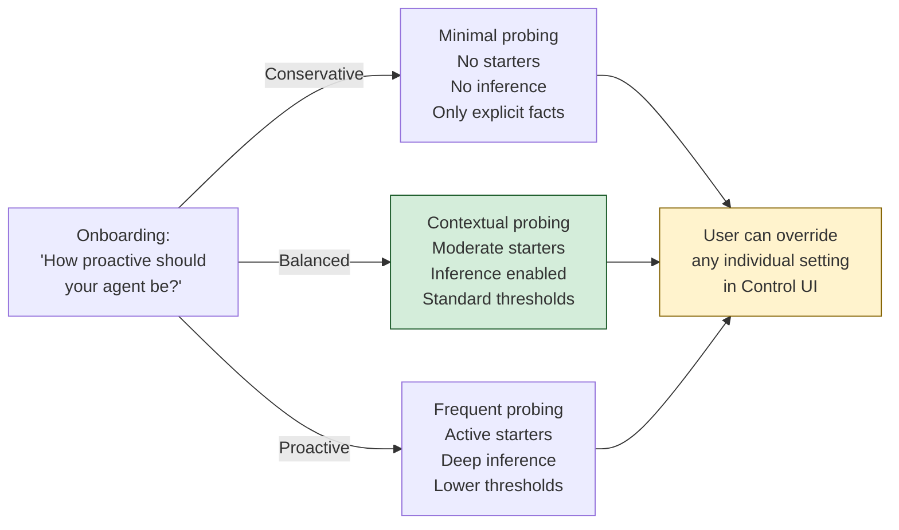

---

### 17. Runtime Configuration Hot-Reload

Some configuration changes should take effect immediately without restarting the EM service. Others require a restart.

| Config Section           | Hot-Reloadable | Why                                                                          |
| ------------------------ | -------------- | ---------------------------------------------------------------------------- |
| `profile.*`              | ✅ Yes          | User preferences change frequently                                           |
| `probing.*`              | ✅ Yes          | User may want to adjust probing mid-conversation                             |
| `starters.*`             | ✅ Yes          | User may want to mute starters temporarily                                   |
| `risk_model.*`           | ✅ Yes          | Threshold tuning shouldn't require restart                                   |
| `confidence.base_scores` | ✅ Yes          | Tuning during evaluation                                                     |
| `decay.*`                | ✅ Yes          | Affects next decay cycle                                                     |
| `extraction.*`           | ⚠️ Partial      | `enable_indirect_inference` is hot; `max_entities` requires pipeline restart |
| `background.*.schedule`  | ❌ No           | Cron schedules registered at startup                                         |
| `llm.*`                  | ❌ No           | Model changes require reconnection                                           |
| `storage.*`              | ❌ No           | Database connections established at startup                                  |

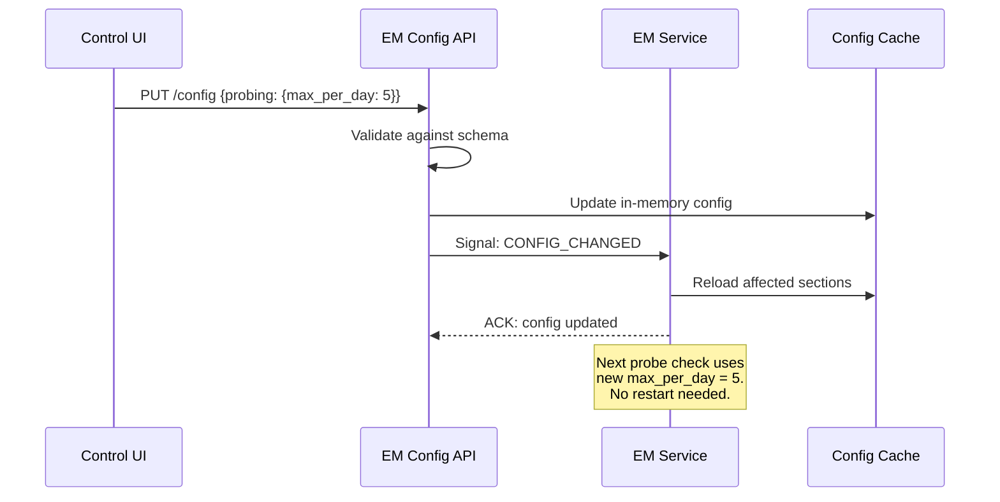

---

### 18. Configuration Validation Rules

| Rule                                                                 | Scope        | Error on Violation                                         |
| -------------------------------------------------------------------- | ------------ | ---------------------------------------------------------- |
| `probing.max_probes_per_day` ≤ `probing.max_probes_per_week`         | Cross-field  | Config rejected                                            |
| `starters.max_per_day` ≤ `starters.max_per_week`                     | Cross-field  | Config rejected                                            |
| `confidence.archive_threshold` < `extraction.min_storage_confidence` | Cross-field  | Warning (facts stored but immediately at risk of archival) |
| `decay.grace_period_days` > 0                                        | Single field | Config rejected                                            |
| `llm.small.temperature` < 0.5                                        | Single field | Warning (higher temp reduces extraction reliability)       |
| `llm.daily_token_budget.small` > 0                                   | Single field | Config rejected                                            |
| `privacy.dp_epsilon` > 0                                             | Single field | Config rejected                                            |
| `quiet_hours.start` ≠ `quiet_hours.end`                              | Cross-field  | Warning (empty quiet hours)                                |
| All `starters.types.*.min_relevance` ≥ 0.0 and ≤ 1.0                 | Range        | Config rejected                                            |
| `background.max_inference_depth` ≤ 5                                 | Range        | Warning (deep chains are expensive and speculative)        |

---

### 19. Per-Entity Configuration Overrides

Some entities may need different treatment than the defaults. For example, the user might want aggressive monitoring for work-related entities but conservative handling for personal/family entities.

```yaml
# Entity-level overrides (stored in Neo4j as node properties)
entity_overrides:
  - entity_match: "Lena"
    overrides:
      probing:
        max_probes_per_week: 2    # Be gentle about probing wife-related topics
      risk_model:
        suggest:
          min_confidence: 0.70     # Higher bar for suggestions involving wife

  - entity_match: "Acme Corp"
    overrides:
      starters:
        types:
          news:
            enabled: true
            min_relevance: 0.30    # Lower threshold — user wants all company news

  - entity_match: "health"
    entity_type: "concept"
    overrides:
      privacy:
        sharing_min_level: "L4"    # Never share health-related knowledge
      extraction:
        enable_indirect_inference: false  # Don't infer health facts
```

---

### 20. Monitoring Configuration Effectiveness

The configuration needs its own feedback loop. SecretAI should track how configuration choices affect user engagement and satisfaction.

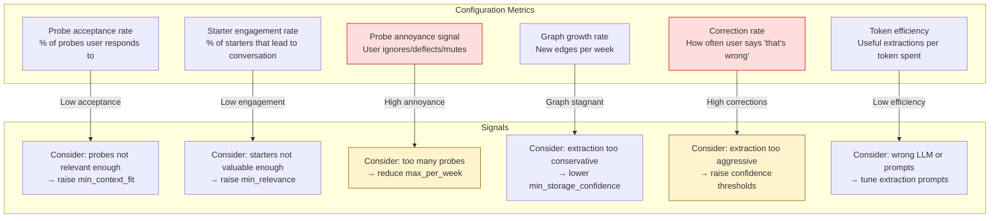

| Metric                                            | Healthy Range   | Action if Out of Range                                                              |
| ------------------------------------------------- | --------------- | ----------------------------------------------------------------------------------- |
| Probe acceptance rate                             | 40–70%          | Below 40%: raise `min_context_fit`. Above 70%: can lower slightly for more learning |
| Starter engagement rate                           | 30–60%          | Below 30%: raise `min_relevance` or reduce frequency                                |
| Probe annoyance signal                            | < 20%           | Above 20%: immediately reduce `max_probes_per_week`                                 |
| Graph growth rate                                 | 5–20 edges/week | Below 5: lower `min_storage_confidence`. Above 20: normal for active user           |
| Correction rate                                   | < 5%            | Above 5%: extraction quality issue — audit pipeline                                 |
| False positive rate (high-confidence wrong facts) | < 2%            | Above 2%: critical — raise all confidence base scores                               |

---

### 21. Document Index

This document is part of the SecretAI Rails Experience Memory documentation series:

| Document                                    | Description                                           | Status         |
| ------------------------------------------- | ----------------------------------------------------- | -------------- |
| Experience Memory Summary                   | Technology overview, competitive positioning, roadmap | ✅ Complete     |
| Security Architecture Comparison            | Confidential VM vs. localhost trust model             | ✅ Complete     |
| Experience Memory Architecture              | System diagrams, data flows, schemas, deployment      | ✅ Complete     |
| **Integration, Testing, and Configuration** | **This document**                                     | **✅ Complete** |
| Experience Memory API Reference             | MCP tool specifications, gRPC protobuf definitions    | 📋 Planned      |
| Extraction Pipeline Tuning Guide            | Per-stage configuration, LLM prompts, evaluation      | 📋 Planned      |
| Knowledge Graph Operations Manual           | Neo4j migrations, backup/restore, performance         | 📋 Planned      |

---

*SecretAI — Agents that learn. Memory that compounds. Privacy that's provable.*